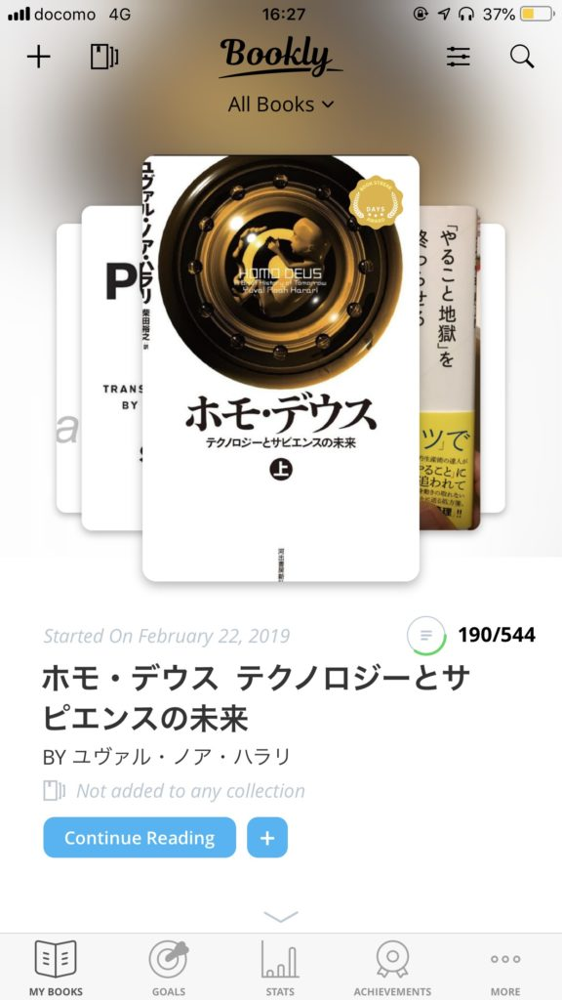
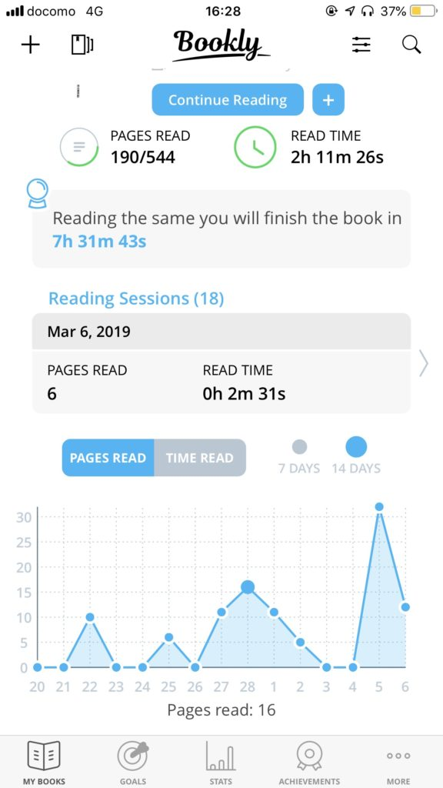
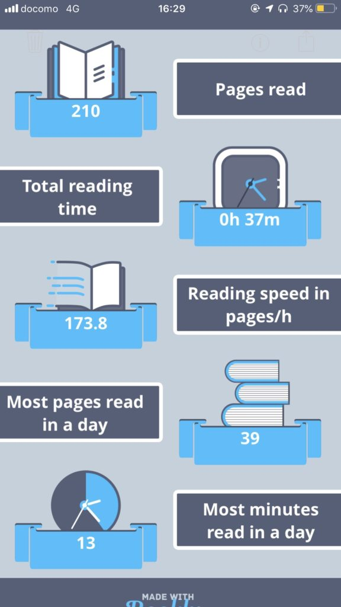
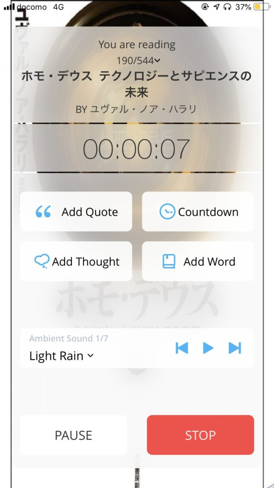
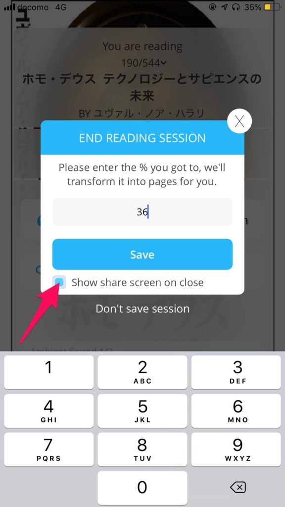
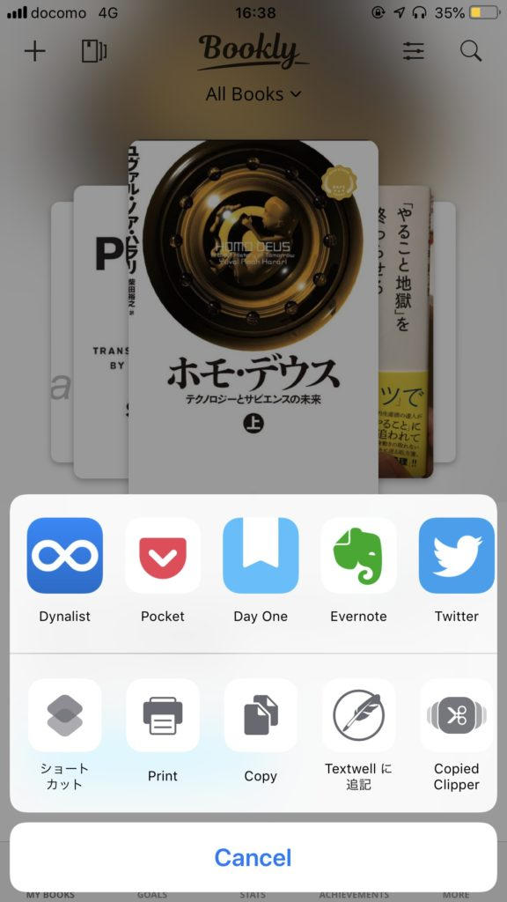

本読んでますか？

ではどれほどの時間を本と過ごし、どれぐらいのページ数を読めているか分かりますか？

わたしも分かりません。分かりませんでした。

でも今はBooklyというアプリが教えてくれます。

というわけでアプリ、Booklyの紹介です。

## Bookly

Booklyは自分がどのぐらいの本のページをどのぐらいの時間をかけて読んだかが分かるアプリです。

本を登録し、読んだ時間とページ数、もしくはパーセンテージ（電子書籍の場合便利です）を入力することで、読んだページ数や時間がグラフで表示されます。

▼登録した画面

▼ここまで読んだページ数や推移などが分かります

## Booklyの効果

### 積み重ねがわかる

Booklyの効果として、まず自分の積み重ねがわかります。

時間に余裕があれば、1週間に2,3冊読むことも可能でしょう。心ゆくまで本を読めれば本を読んだという満足感をえることもできます。

しかし、現代はやるべきこと、やりたいことが見渡せばたくさんある世界です。

1日に本が数ページしか読めないこともあります。

本を読んだという満足感、達成感は手をまた次の読書へと向けさせてくれるものです。本を読める時間が少なくなれば自然と満足感は少なくなりがちです。

しかしBooklyはほんの少しの時間でもその積み重ねを見せてくれます。

満足感は得られないかもしれませんが、読書を積み重ねられているという自信を与えてくれます。

その自信が明日も本を読むという足がかりになるはずです。

読み終わるとこんな画面がでるのも、私としてはわくわくします。

### 脱線を防ぐ

脱線をすれば、その分だけ本を読む時間は減ります。

Booklyではタイマーをスタートすれば、時間を止めない限り、時計は流れ続けます。脱線しても、時間が流れていきます。

脱線をすると、時間に対して読めたページが少なくなるわけです。事実と異なる数値というのは、なかなか気分がよくないものです。

また、Booklyには本を読むのに適したBGMを7種類かけることができます（無料版では一種類）。

▼読書中の画面。画面下部でBGMを選択可能

本を読むときにBGMをかけるのが習慣になれば、逆にBGMをかけることで本を読むモードへ切り替えやすくなります。

タイマーやBGMにより脱線を防ぎ、本を読むモードを維持しやすくなるのです。

### 読書録が取りやすい

わたしはこれが一番気に入ってるのですが、読んだページを記録した後に共有画面が表示できるのです。

▼矢印の部分をチェックしておけば共有画面が出ます

これが本に関するアウトプットをものすごい促してくれます。

本を一冊読み終わった後に読書録を書こうとすると、すでに内容がおぼろげになってるんですよね。

わたしなんかは、本を一冊読むのに時間がかかります。

1週間以上はざらです。そうすると読み終わった後の感想が、極端なことを言えば「おもしろかった」「つまらなかった」となります。

その感想は間違ってはいないのです。しかし本を読んでいる間に感じたものが、ポロポロと抜け落ちていってしまった感覚が拭えません。

でも読書録を読んでいる最中も少しずつでも残しておけば、感じたことをより多くすくい取れると思うのです。

また、本を読んで「なるほど！」と思ったことでも、本を閉じてから思い出そうとすると既に内容があいまいになってることが結構あります。

でも読書の後に内容や考えたことについて少しでも、数行でもいいから書いてみる。それだけで定着度がちがいますし、何より後から読み返して、思い出すことができます。

Booklyは読書録への道をスムーズにすることで記録しやすくしてくれます。

何に感動したのか、どんなことを思ったのか、内容に刺激されで浮かんだイメージはなにか。

そんなことをBooklyは残しやすくしてくれるのです。

わたしのおすすめの読書録ツールはDayOneですが、Evernote、twitterなどに残してもいいでしょう。じぶんの好きなところに残しておけます。

## 有料版と無料版の違い

ここまでアプリについてご紹介してきましたが、有料版と無料版でどうちがうかが気になるところです。

記事を書いている2019/3/9現在以下のような違いがあります。

|  | 無料版 | 有料版 |
| --- | --- | --- |
| 登録できる本の数    | 10 | 無制限 |
| 本の画像を撮影 | × | ○ |
| 画像のテキスト化 | × | △（英語のみ） |
| 目標の設定 | ・ 月間の読書時間 | ・月間の読書時間   ・年間の読書冊数 |
| 音楽の種類 | 1種類 | 7種類 |
| iCloudへのバックアップ | × | ○ |
| 有料版オファーの表示 | あり | なし |

無料版でかなり気になるのが「有料版にしませんか？」というオファー画面が1日1回ぐらい出てくるところです。記録がスムーズにできません。

わたしは買い切りのプランがあったので6000円で買いきりにしました。かなり悩みましたが、年額でも2200円ぐらいでしたので買いきりにしました。

本についてのアウトプットを促してくれたのが決め手でしたね。ずっと使い続ければ悪くない選択だと思っています。

## おわりに

というわけで、あなたをより読書にむかわせてくれるアプリBooklyの紹介でした。

**[Bookly - Read More](https://itunes.apple.com/jp/app/bookly-read-more/id1085047737?mt=8&uo=4&at=11l5XR)**  
価格: 0円(2019/03/09 16:16)  

ぜひ試してみてください。

Log is for Happy!!

* * *

アプリや読んだ本などの紹介をしているPodcastも始めました。

クオリティはまだまだですが、よろしければお聴きください

[https://anchor.fm/u3086u3046u3073u3093u3084](https://anchor.fm/u3086u3046u3073u3093u3084)
