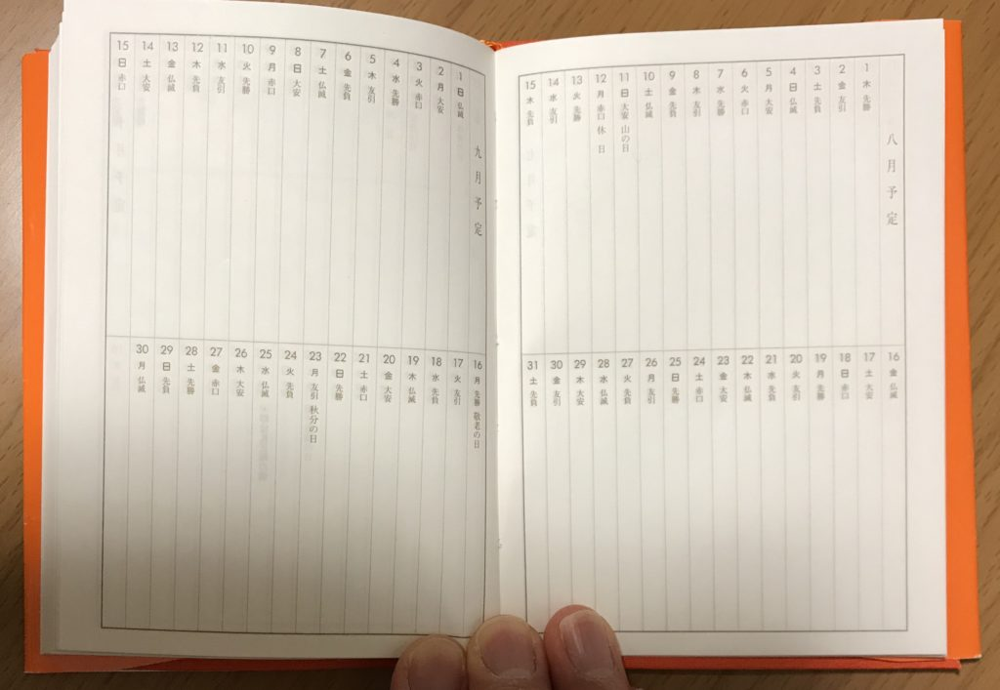
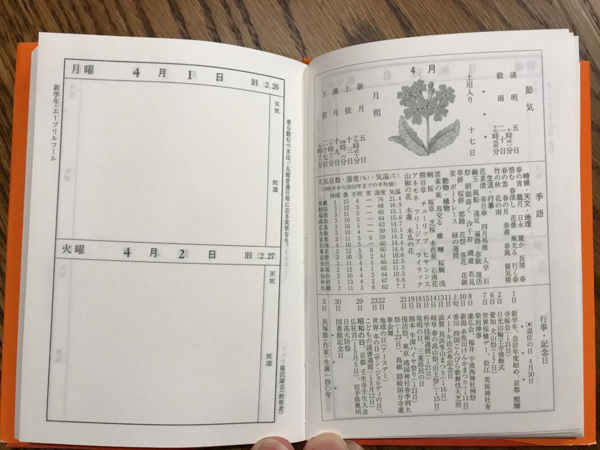
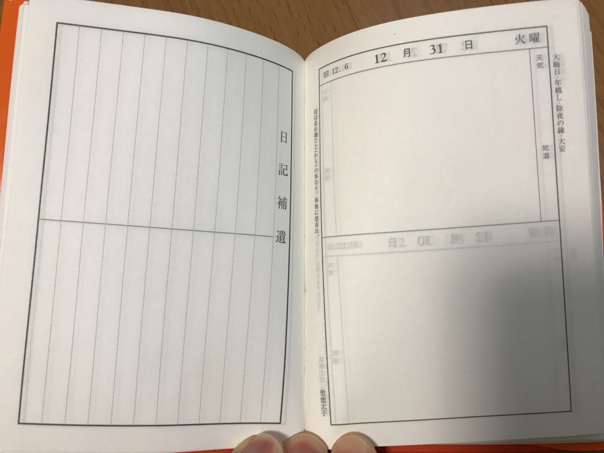
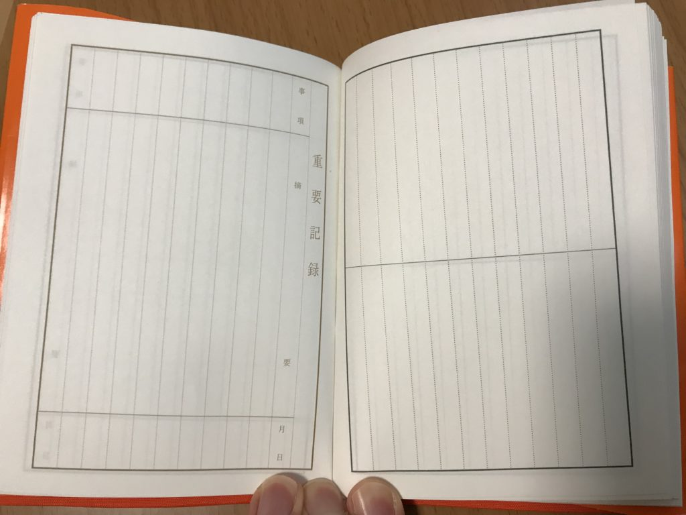
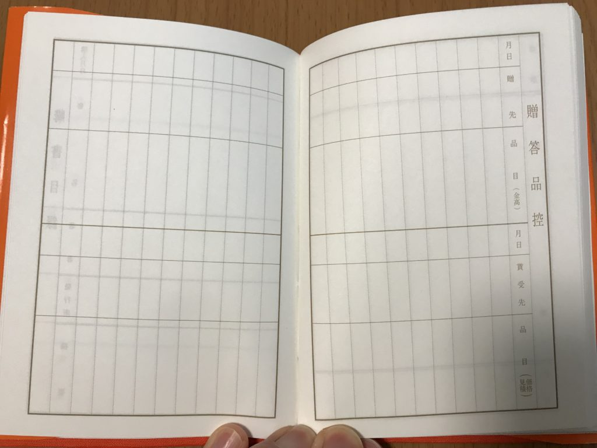
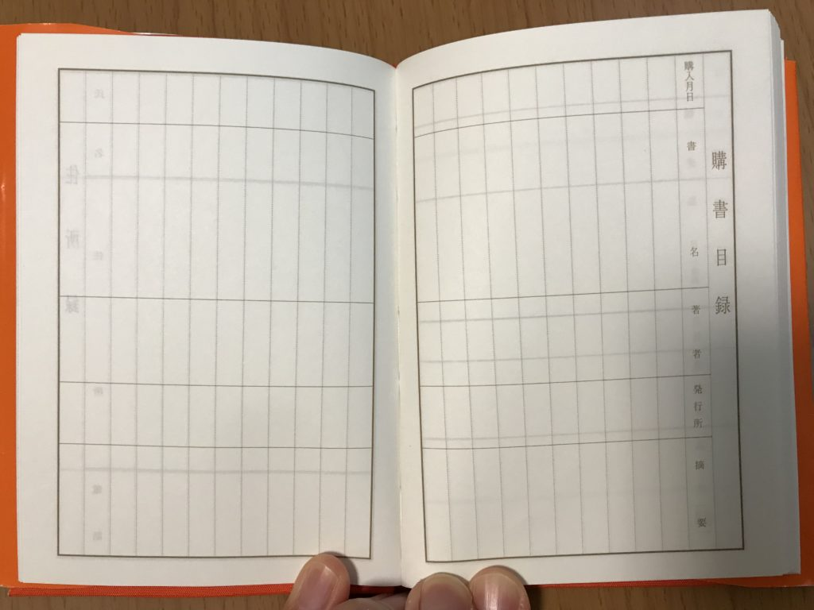
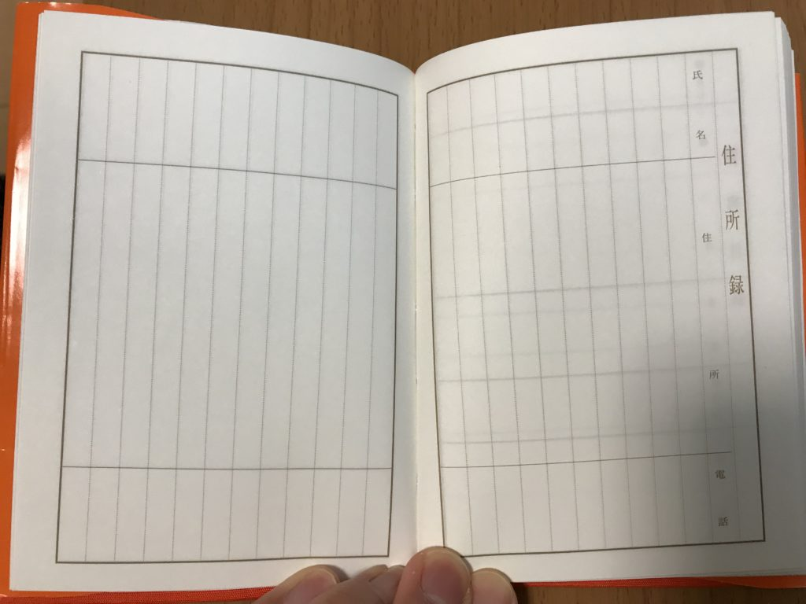
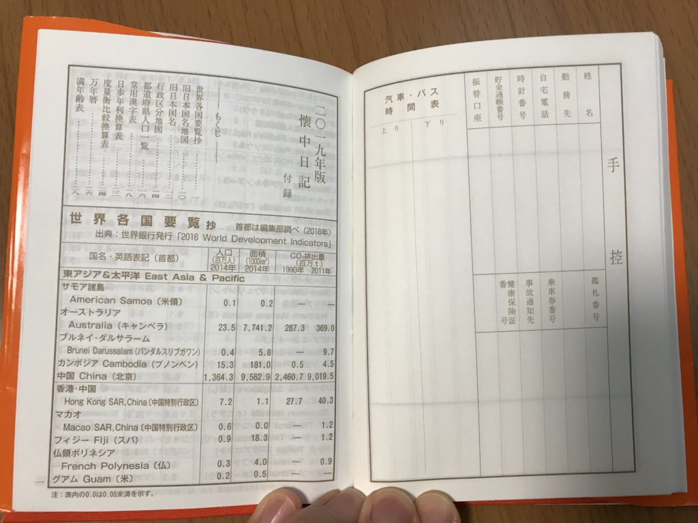

こちらの記事にもあるように、懐中日記を買いました。大きさはB7です。

[https://note.mu/mailman/n/ne3fad98f07aa](https://note.mu/mailman/n/ne3fad98f07aa)

この記事をみて、懐中日記を買ってくださった方もいて記事を書いてよかったなぁとしみじみ思います。

B7の大きさだと写真にあるように長さはボールペンとほぼ同じぐらいで、とてもコンパクトです。  

そして、この懐中日記を2ヶ月使ってみました。なかなかいい感じです。

そこで使用感とともにご紹介したいと思います。

## 表紙

1番上のアイキャッチ画像にあるように、今年の十二支の絵が書いてあります。お世辞にもかわいい絵とは言えませんが、迫力があります。

カバーを外すとオレンジ色の無地に2019と書いてある表紙になるので、カバーなしでも使えます。

## カレンダー欄

次はカレンダー欄です。

予定を書き込むというよりは、その日にあったことを書いた方が良さそうです。

私は[1行日記](https://log-is-fun.com/one-sentence-diary1/)として活用しています。  

## 日記欄

次に日記を書く欄です。天気と気温を書くスペースもあります。

欄外に名言などが引用されています。

実際に書いてみると文字の大きさにもよりますが、だいたい200文字ぐらいは書けます。

1日の最後にさっと書くぐらいならちょうどいい大きさです。

旅行などでカバンに入れておいても邪魔になりません。

旅行先で書く日記はまたちがった味わいがあります。せっかくのイベントなので、日記は書いておきたいところです。

ただ写真などを貼るとなるとスペース的に厳しそうですね。

そうした日記を書きたい方はもう少し大きめの日記帳かほぼ日手帳のような1日1ページの手帳がいいかもしれません。

## 記録欄

日記欄が終わると、最後に記録欄が出てきます。

まず日記補遺が6ページ。あまり見かけない言葉ですが、補遺とは日記に書いておきたかったのに書き漏らしてしまったことを書く欄です（この日記で初めて補遺ということばを目にしました）。

重要記録欄が5ページ

贈答品控えが2ページ

購書目録2ページ

住所録8ページ

自分の名前や住所などを記入する欄が1ページ、その後には都道府県の人口などいろんなデータがまとめてあります。

あまり見ない読書目録などのこうした記録系ページは忘れやすいので、付箋をつけるなどして思い出せるようにしておくといいと思います。

わたしは割り切ってこのあたりのページは活用していません。

## しおり

しおりは紐のものが一本ついています。

付いている紐のしおりは、日記欄のところではなく、1行日記を書いているカレンダー欄や、忘れやすい読書録のところなどに挟んでおく手もあります。

私は一行日記を書いているカレンダー欄にしおりを挟んであります。

## おわりに

懐中日記から手帳が生まれたという話を聞いたことがあります。 旧大蔵省印刷局による懐中日記が元になっているそうです。

確かにこの日記なら、手帳として活用することもできるかもしれません。

手帳のように持ち歩いたり、旅行に持って行ったりできる、そんな身軽さがあります。

ぜひ試してみてください。

Log is for Happy!!

<iframe style="width:120px;height:240px;" marginwidth="0" marginheight="0" scrolling="no" frameborder="0" src="//rcm-fe.amazon-adsystem.com/e/cm?lt1=_blank&amp;bc1=000000&amp;IS2=1&amp;bg1=FFFFFF&amp;fc1=000000&amp;lc1=0000FF&amp;t=do0909-22&amp;language=ja_JP&amp;o=9&amp;p=8&amp;l=as4&amp;m=amazon&amp;f=ifr&amp;ref=as_ss_li_til&amp;asins=4781527345&amp;linkId=aab5c11db5fd6d4a2eefb0a8764e472c"></iframe>
