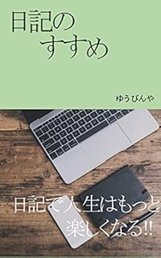

ログハピ！！の方は久しぶりの更新となってしまいました。こんにちは、ゆうびんやです。

今回は阿久悠さんの「アンチロマン日記」を紹介します。

阿久悠さんといえば作詞家として数々の大ヒット曲を出している方として知っている方も多いのではないでしょうか。

そんな阿久悠さんは日記を執筆当時、23年続けていた方でもあります。そして、23年間続けた日記を阿久悠さんは「アンチロマン日記」と名付けています。

自分についてだけの記録ではなく、自分を通した世界の記録、それもまた自分の記録となりうるのです。

## アンチロマン日記

それではアンチロマン日記とは何なのか。阿久悠さんの書いた「日記力」から少し引用します。

> “僕の日記は、多少の情緒はありますが、基本的には、その日、僕のアンテナに引っかかってきた出来事だけをつづったものです。世界情勢から、その日の気象、スポーツの結果まで、1日の出来事が同列にニュース価値を持つという独特な日記です。いわばアンチロマンの日記と言えるでしょう。”  
> 
> 「日記力 『日記』を書く生活のすすめ」 阿久悠

阿久悠さんの日記は自分の行動などの記録ではなく、自身のアンテナに引っかかったニュースなどに重きを置き、感傷的な表現を排除しています。

詳細については阿久悠さんの「日記力」を読んでいただくと実際の日記のページがあってわかりやすいのですが、円ドルレートやスポーツの結果、そこに混じって創作のアイデアや自身の行動、名刺をもらった人の名前などが１つのページにまとまっています。

ではなぜこのような感傷的な表現を排除した日記が生まれたのでしょうか。

それは阿久悠さんが、独自性にこだわったからです。

日記と言うと、やはり自分の行動や自分の内面を記録していく印象があります。しかし阿久悠さんは独自性にこだわりました。

独自性にこだわったからこそ、多くのヒットを出すことができたという自負もあります。

そこでオリジナリティのある日記として観察者としての日記ができないかと考えました。

その独自性を考えてできたのが観察者としての日記、感傷的な記述を避ける日記、「アンチロマン日記」です。

では、このアンチロマン日記は独自性以外にどんな意味があるのか？

それは観察結果を通した自分の興味の記録です。

### 興味を通して自分を記録する

阿久悠さんの日記の特徴のひとつとして、1日のニュースに自分なりに順位をつけることがあります。

あくまで自分なりというのがポイントです。

たとえばスポーツのニュースより政治や社会のニュースの方がなんとなく高尚な感じがします。ですから、ランキングをつけるとどうしても政治や社会のニュースに高い順位をつけてしまいがちです。

しかし、じぶんなりに順位をつけるならば芸能やスポーツ、あるいは猫の駅長のニュースが一位になることもあるでしょう。

そして、いつもスポーツが1位になっている自分のランキングで、政治の話題が1位になれば、その話題は自分にとってかなりインパクトの大きい話題なのだとわかります。

ニュースを記録するだけではその日にあったニュースが記録されるだけです。もちろんそのニュースが気になったんだなということはわかります。

しかし、順位をつけることで自分の興味の度合いも記録できるのです。

順位をつけることで、自分の興味がどう移り変わっているか、何に興味を持っているのかが見えてきます。

SNSで気になったニュースをツイートしている方は多いです。それらのニュースを少し順位づけして日記にすれば、それはもう「アンチロマン日記」と言えるでしょう。

あなたはすでにアンチロマン日記を書く準備ばできているかもしれませんね。

### 時代を見る目

では自身の興味を順位づけすることの意味はなんでしょう。それは順位づけによる情報の咀嚼です。

このニュースは自分にとってどんな意味があるのだろうかと順位をつけることで自然と問いかけることができます。

いまニュースのような時事情報が受け取りきれないぐらいにあふれていることを否定する方はいないでしょう。

またフェイクニュースという言葉を聞くことも多くなっています。

そんな情報が溢れる今だからこそ、情報を咀嚼するための日記、アンチロマン日記が助けになります。

世の中にとって、そのニュースがどんな位置付けなのかも大事ですが、自分にとってのニュースの位置付けも重要です。

そしてそれは自分自身にしかわからないことです。

情報を咀嚼する、そして情報が折り重なってできる今という時代を見る目を養う、それが稀代のヒットメーカーである阿久悠氏がアンチロマン日記を書き続けた理由と言えるかもしえません。

## おわりに

阿久悠さんのアンチロマン日記についてご紹介しました。気になった方は書籍「[日記力―『日記』を書く生活のすすめ](https://amzn.to/2DT2StH)」の方もチェックしてみてください。

また、現在アシタノレシピで「めざせ日記大全」を連載中です。noteの方も更新をしてますのでよかったらそちらも見に来てくださいね。

[https://www.ashi-tano.jp/?tag=%E6%97%A5%E8%A8%98%E5%A4%A7%E5%85%A8](https://www.ashi-tano.jp/?tag=%E6%97%A5%E8%A8%98%E5%A4%A7%E5%85%A8)

[https://note.mu/mailman/m/m3ee948bf5c59](https://note.mu/mailman/m/m3ee948bf5c59)

Log is for Happy!!

* * *

▼Kindle Unlimited対象です

