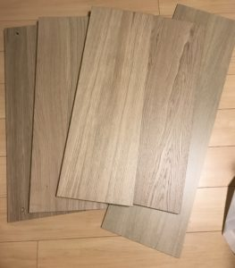
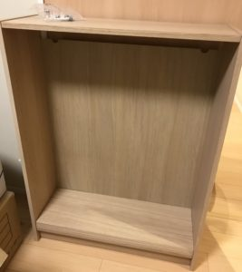
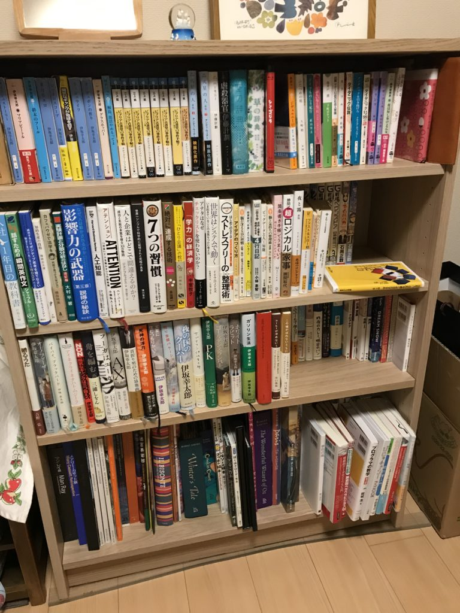

本棚買うのってものすごいわくわくしませんか。

実は最近引っ越しまして、ついに念願の書斎スペースができそうなのです（パチパチパチ）

前の家では本棚がおけませんでした。とりあえず書斎には本棚でしょというわけで、まずは本棚の選定です。

堀正岳さんの「知的生活の設計」を参考にして、最終的にIKEAの本棚「Billy」を購入しました。

高さ106cm、横幅80cm、奥行き28cmのものです。

高さ202cmのものもあります。本がいっぱい入りそうなのでとても魅力的です。

しかし賃貸だと地震対策が不十分になりそうなので、まずは対策のしやすい小さいものにしました。

## 組み立て

板が8枚ほどあって、それを組み立てます。

組み立て途中

完成です。

写真にすると3枚ですが、時間にすると約90分ほどかかりました。こうした作業に慣れている方なら1時間以内にできると思います。

Billyはデフォルトでついてくる棚板が2枚なのて、棚板を追加して3枚にして4段にしました。

容量を最大限活かすなら、棚板は追加したほうがいいと思います。

### 入る本の数

入る本の数を数えてみると合計で274冊でした。内訳は

文庫本、新書：103冊 マンガ(少年漫画サイズ)：31冊 マンガ（単行本）：40冊 単行本：71冊 大判本：29冊

です。単行本や大判本が少なければ300冊後半は入ると思います。

### 組み立て時の注意点

特に注意するところはないんですが、ハンマーが必要な工程があります。うちにはなかったので、Amazonで注文しました。

<iframe style="width: 120px; height: 240px;" src="//rcm-fe.amazon-adsystem.com/e/cm?lt1=_blank&amp;bc1=000000&amp;IS2=1&amp;bg1=FFFFFF&amp;fc1=000000&amp;lc1=0000FF&amp;t=do0909-22&amp;language=ja_JP&amp;o=9&amp;p=8&amp;l=as4&amp;m=amazon&amp;f=ifr&amp;ref=as_ss_li_til&amp;asins=B000ARNBNG&amp;linkId=7cb5a557a84c398cd74db147c3d668b0" frameborder="0" marginwidth="0" marginheight="0" scrolling="no"></iframe>

もし持ってない方は準備しておきましょう。

あと耐震対策が必要です。本棚が倒れてくると危険です。

賃貸の場合、壁に釘を打てないため、傾ける耐震器具と賃貸でも使えるような留め具を組み合わせて地震対策をしました。

高さによっては突っ張り棒を使うのも有効だと思います。

<iframe style="width: 120px; height: 240px;" src="//rcm-fe.amazon-adsystem.com/e/cm?lt1=_blank&amp;bc1=000000&amp;IS2=1&amp;bg1=FFFFFF&amp;fc1=000000&amp;lc1=0000FF&amp;t=do0909-22&amp;language=ja_JP&amp;o=9&amp;p=8&amp;l=as4&amp;m=amazon&amp;f=ifr&amp;ref=as_ss_li_til&amp;asins=B000FQPBNU&amp;linkId=8b312ab08725177363b46bb6630f7ca2" frameborder="0" marginwidth="0" marginheight="0" scrolling="no"></iframe>

## おわりに

いま組み立ててから2週間ほど使っていますが、いいですね。オシャレ感があります。

本棚を買った理由は、書斎が欲しいというのもありますが、子どもに本に触れて欲しいからというのもあります。

本棚があると子どもが勝手に読みたい本を読みます。

私も親の本棚から勝手に東野圭吾さんとか森博嗣さんの小説や、明らかに対象年齢に入ってないマンガもたくさん読みました(総務部総務課山口六平太を読む中学生はあまりいないでしょう)。

そうした読書は間違いなく今の私を形作っています。

わたしも、子どもにそんな環境を作っておきたいと思っています(本を読むかどうかは子ども次第ですが)。

そんな将来も少し見据えて、本棚と付き合っていきたいと思います。

Log is for Happy!!

<iframe style="width: 120px; height: 240px;" src="//rcm-fe.amazon-adsystem.com/e/cm?lt1=_blank&amp;bc1=000000&amp;IS2=1&amp;bg1=FFFFFF&amp;fc1=000000&amp;lc1=0000FF&amp;t=do0909-22&amp;language=ja_JP&amp;o=9&amp;p=8&amp;l=as4&amp;m=amazon&amp;f=ifr&amp;ref=as_ss_li_til&amp;asins=B07D21LT3H&amp;linkId=8ff9d31783f58d953e28cb62c2faf67b" frameborder="0" marginwidth="0" marginheight="0" scrolling="no"></iframe>

* * *

 [ 知的生活の設計―――「10年後の自分」を支える83の戦略](//af.moshimo.com/af/c/click?a_id=765702&p_id=170&pc_id=185&pl_id=4062&url=http://www.amazon.co.jp/dp/4046023449)
