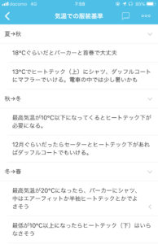

投稿日: {{ page.date | date: '%Y-%m-%d' }}

季節の変わり目は服装に迷いますよね。仕事前の朝に服装に迷うと時間もなくなります。

でも、いつもと同じでいいやと思って、出掛けてみると、暑かったり、寒かったりして、快適に過ごしにくい。

そんな迷ったときに使えるのが日記や記録です。

例えば冬から春に気温が上昇していく時、どんな服装で出かけて、その時どう感じたかを記録しておきます。

中に着ているヒートテックは長袖か、半袖か。  
着ているコートは電車の中で暑すぎなかったか。

こうしたことを記録しておくことで、どのような服装にするかを決めやすくなります。

記録するのは手帳やスマホといった慣れたものに記録しておきましょう。わたしはたすくまというアプリで記録しています。

しかし記録しても活用しないと意味がありません。そこでチェックリストです。

例えば、手帳のフリースペースやスマホのアプリにチェックリストを作っておきます。iphoneのデフォルトにあるリマインダーアプリに作ってもいいですね。

むしろ、リマインダーに記録しておいて、そのままチェックリスト化するのもいいかもしれません。

わたしはtodoistというアプリにチェックリストを作っています。

このリストを服装に迷った時に見直すことで、より快適に1日を過ごしやすくなりました。

同じ温度でも、冬から春になっている時と、春から冬になっている時では感覚がちがうので、どの時期に関する服装なのかはチェックリストの中に入れておくとよいと思います。

他にも花見の時にマスクが必要などの情報も入れておくとより有効なリストになりますね。

スーツなどを切るときのチェックポイント（ハンカチを入れたか、ほこりはとったか）なんかも入れておくと効果的です。

わたしは基本的に私服通勤なので、たまにスーツを着るときによくチェックリストを参照しています。

季節の変わり目が近づいてきたこの時期にやって損はない記録の活用方法です。  
  
（この記事は[note](https://note.mu/mailman)とのクロスポストです）
