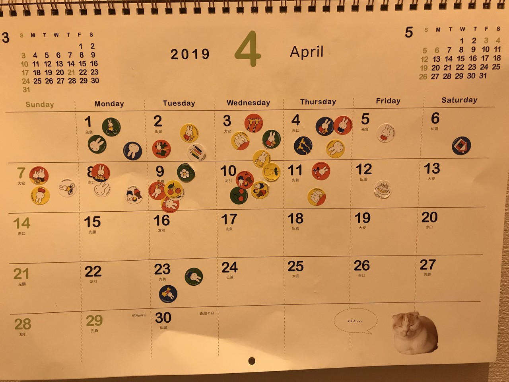

こんにちは、ゆうびんやです。

こう見えて（どう見えて？）一児の父です。

最近は子供のトイレトレーニング真っ盛りです。トイレに少しでも行きたくなるようにトイレに行ったら、ご褒美としてシールを貼らせています。

貼るのはすごろく式のシール台紙で10回貼ったらゴールする台紙を使ってました。 

でもトイレトレーニングって長丁場ですよね。そしてすごろく式ってすぐゴールしちゃいます。

印刷できるシール台紙もありますが、なかなかめんどうです。

▼最終的にマスを無視して縦横無尽に貼られたシール

だったらとカレンダーに貼るようにしてみました。

するとなかなかいいんですよ。

すごろく式では日々の変化は見えにくいのですが、カレンダーならできた日はどのぐらいあったのかとか、だんだんできてない日が減ってきたとかがわかります。

我が子も我が子なりに実は結構がんばってると気づけました。

こういうカレンダーでの記録はいいですね。

見たら記録することを思い出せますし、家族みんなでの共有することも簡単。

他にもお手伝いの回数、読んだ本の数とかいろんなバリエーションにも使えそうです。
