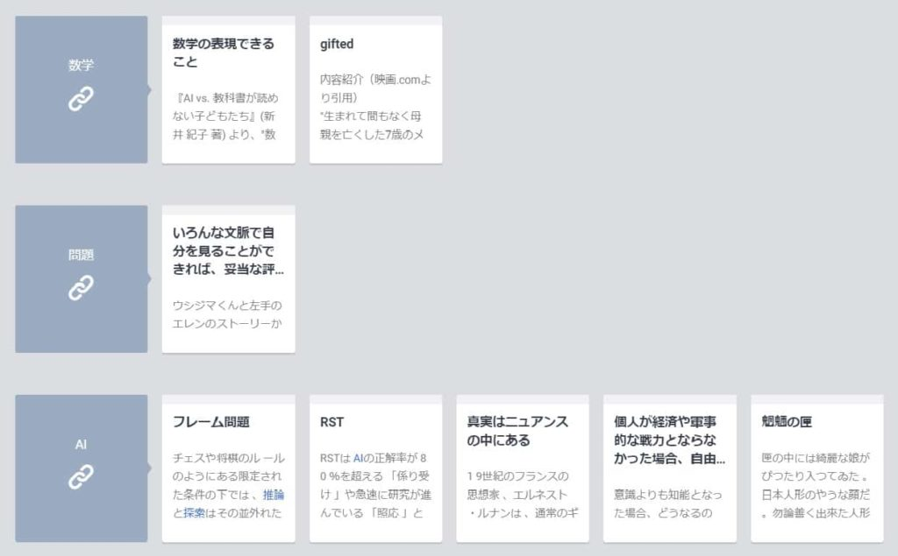

投稿日: {{ page.date | date: '%Y-%m-%d' }}

最近「ほんぽっぷ」という本や映画、マンガの紹介ブログを始めています。

[https://honpop.com/aitokaseigitoka/](https://honpop.com/aitokaseigitoka/)

いままでブログ記事はアウトライナーのDynalistで書いていたのですが、このほんぽっぷでは自分の中の新たな試みとして、Scrapboxで記事を書いてみることにしました。

これがなかなかいい感じです。

Scrapboxをものすごく簡単に説明すると、自分専用のwiki的なものがすっごい簡単に作れて、かつページ間のリンクも簡単にできるウェブサービスです。

語句を\[ \]で囲むだけで、他のページの同じ語句とリンクされ、ページの下部にリンクされたページが表示されます。

このリンクが思いもがけないページとつながって、発想を刺激してくれるのです。

例えば「数学」「問題」「AI」などの語句をリンクにすると下の画像のように関連するページが下の方に表示されます。

考える手札がずらーっと出てくるようなそんな感覚です。

この手札を使いながら、記事を書き進めたり、思わぬ方向に記事をつなげていくことができたりします。

これはDynalistでは得られなかった感覚です。

ではどんな手札が配られるのかを簡単にご紹介します。

### 手札１．アイディアメモ

読書中や通勤中などに思いついたアイディアです。今まで活用しにくかったアイディアが、ふとしたタイミングで活用できます。

実は最初「ほんぽっぷ」をScrapboxでそのまま公開することも考えたのですが、そうすると自分の簡単な思考のメモ、一言しか書いていないページなど、あまり公開するのに適していないページが含まれてしまいます。

この思考メモを活かすために、wordpressでほんぽっぷをはじめた部分はあります。

### 手札２．スクラップした記事とリンクする

最近はおもしろかったネット上の記事はScrapboxに保存しています。

たとえば以前書いたこちらの記事です。

[https://honpop.com/gifted/](https://honpop.com/gifted/)

ここでは、Scrapboxに保存しておいた、以下の記事とつながりました。

[https://jp.quora.com/7%E6%AD%B3%E3%81%AE%E6%81%AF%E5%AD%90%E3%81%8C%E3%81%84%E3%82%8F%E3%82%86%E3%82%8BGifted%E3%81%AA%E5%85%86%E5%80%99%E3%81%8C%E3%81%82%E3%82%8A-%E6%9D%B1%E4%BA%AC%E3%81%AE%E5%85%AC%E7%AB%8B%E5%B0%8F%E5%AD%A6%E6%A0%A1/answers/142817195](https://jp.quora.com/7%E6%AD%B3%E3%81%AE%E6%81%AF%E5%AD%90%E3%81%8C%E3%81%84%E3%82%8F%E3%82%86%E3%82%8BGifted%E3%81%AA%E5%85%86%E5%80%99%E3%81%8C%E3%81%82%E3%82%8A-%E6%9D%B1%E4%BA%AC%E3%81%AE%E5%85%AC%E7%AB%8B%E5%B0%8F%E5%AD%A6%E6%A0%A1/answers/142817195)

今までEvernoteに保存していたのですが、ほとんど死蔵していて、活用できてなかったんですよね。

Scrapboxだと自然と活用できるのでうれしいです。

いま一日一ページぐらいのペースでEvernoteからScrapboxへ記事をうつしています。

ちなみにこちらのブックマークレットを使うとスクラップが便利です。

https://wineroses.hatenadiary.org/entry/20171125/p1

### 手札３．ハイライト選

本を読んだ後はハイライトを3~9個ぐらい選抜して、Scrapboxに保存しています。

このハイライト選とリンクされると、他の本と関連していることに気づくことがあります。

マンガと小説と哲学書に跨っていることもあるので、おもしろいです。

## 具体例

最後にScrapboxで記事を書くと、こんな感じにつながることがあるよーという具体例をご紹介します。

「凪のお暇」という漫画の紹介記事を作成中のことです。この漫画のキーワードに「空気」があります。

この「空気」を\[ \]で囲んでリンクにすると、次の記事がScrapbox上で表示されました。

[https://gendai.ismedia.jp/articles/-/63760](https://gendai.ismedia.jp/articles/-/63760)

空気にあらがう一つの方法に「沈黙」があるといった内容です。

この記事を読むと「沈黙」と「お暇」って共通しているのかも、と思いつきました。空気と距離を取ることが重要なのではないかと。

そこで「距離」をリンクにしてみると、『7つの習慣』の「刺激と反応の間」のページが出てきました。

そのページに合ったリンクの一つが仏教の渇愛についてです。

ただ単に語句を\[ \]でくくってリンクをつくるだけで、こうしたつながりが見えてきます。

ネットには膨大な情報がありますが、Scrapboxにはあくまでじぶんがおもしろいと感じた記事やアイディアなど、ちょっと手間をかけてでも記録しておきたかったことが蓄積されています。

じぶんがおもしろいと思ったもの同士が、まるでピンボールのようにつながっていくんですから、おもしろくないわけがありません。

というわけで、今回はScrapboxで記事を書くとすっごいおもしろいよという話でした。

リンク
