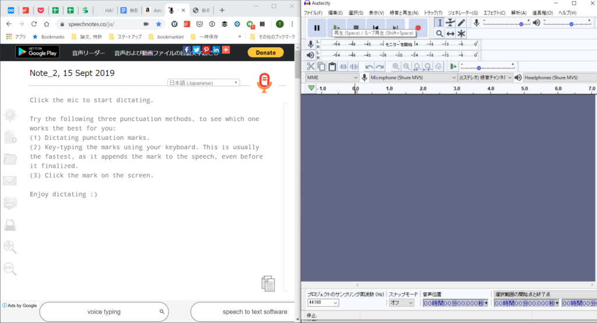
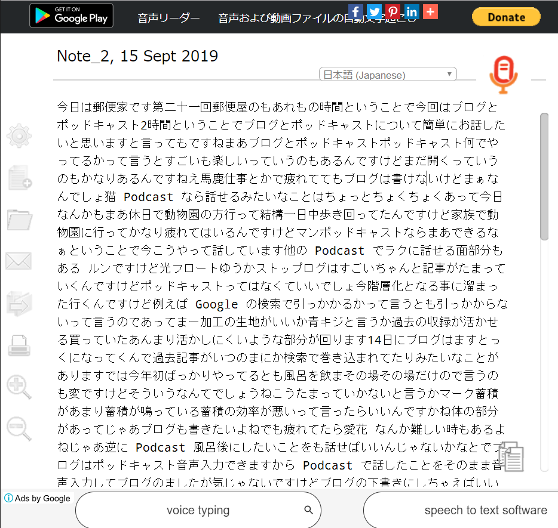

投稿日: {{ page.date | date: '%Y-%m-%d' }}

いま、ポッドキャストに少しハマっています。

[https://anchor.fm/mailman](https://anchor.fm/mailman)

仕事とかで疲れててもブログは書けないけど、Podcastなら話せるみたいなことがちょくちょくあって、休日で家族で動物園に行って一日中歩き回った後でも、ポッドキャストなら「まあできるなぁ」ということもありました。

でもPodcastは、検索とかにほとんど引っかからないので、気楽に話せる一面もありつつも、蓄積という面ではひ弱なんですよね。

ブログもうまく並行してやりたいなぁと思っていました。

過去記事が検索されて、いつのまにかいっぱい読まれてたみたいなことも、ポッドキャストだとなさそうですからね。

そこでひらめいたのが、音声入力でポッドキャストを収録すると同時に、音声入力で文字起こしをして、ブログの下書きにしてしまう方法です。

ブログで書きたいけど書けていないネタをポッドキャストで話せば、どんどんブログとしてアウトプットできます。

## やり方

[Speechnotes](https://speechnotes.co/ja/)と収録ソフトを起動、わたしはAudacityを収録ソフトに使用してます。

SpeechnotesはGoogleドキュメントでもよさそうです。。

▼二画面にして起動したとき

Speechnotesのマイクのアイコンを押した後、Audacityで収録を開始。

収録後、文字起こしされた結果です。

誤字、誤変換はご愛嬌といったところですが、話した本人なら、大体の内容は分かります。

いままでAnchorというアプリでスマホで録音していたのが、パソコンを使うようになって、こういう収録と文字起こしを並行してできるようになったのは大きいですね。

## やってみた感想

音声入力で入力した文章がそのまま使えることは、あまりありません。

でも、一から文章を書くよりも圧倒的に楽です。

話すことでブログで何を書いたほうがいいのかが、見えてきますし、たぶんブログを普通に書いてたら抜けてたであろう内容や表現も、話すことで取り入れることができたんじゃないかなと思います。

誰かに説明するときって、話しながら、「あぁここも説明しておくといいな」みたいな思いつきがポンと出てくることが多いんですよね。

文章として書いている最中に思いついて、構成とかにもう一度手直しが入るより、書く前にわかっていたほうが手間が省けます。

そういう意味では、記事の質をアップさせることにも、ポッドキャストと音声入力を活用する方法は貢献してくれそうです。

時短の方ですが、例えば今回のもとになった、ポッドキャストでは収録約7分で、文字起こしの文字数は2350文字になっていました。

<iframe src="https://anchor.fm/mailman/embed/episodes/21-Podcast-e5cq9l/a-anj71l" height="102px" width="400px"></iframe>

そしてブログに文章として整形に約20分、いらない部分を消して、表現などを調整したり、文章だとわかりにくいところを直したりした結果、1200文字程度になりました。

今回は画像を入れたので、そこで10分。見直しに10分。

ブログとしての所要時間はほぼ40分。個人的には相当な早くなった印象です。

内容にもよりますが、一つの記事にだいたい1時間以上はかかっていたのでだいたい1/2に短縮されました。

ちょっとびっくりです。

そのうえポッドキャストとして、配信すればブログでは届かない人にも届くかもしれない。

そう考えると、いいことづくめですね。

時短とブログの質アップのために、これからどんどん音声入力を活用していきたいと思います。

* * *
