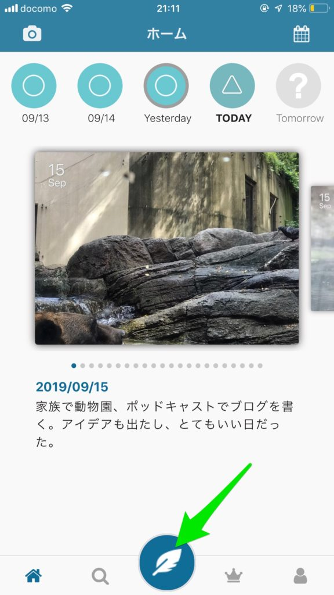
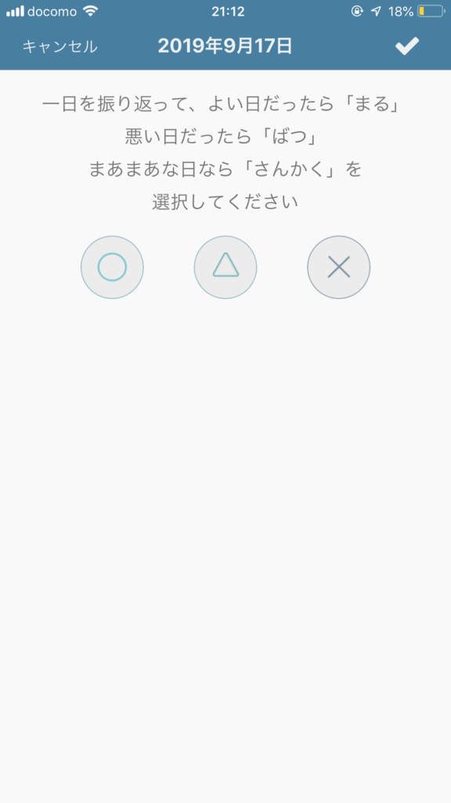
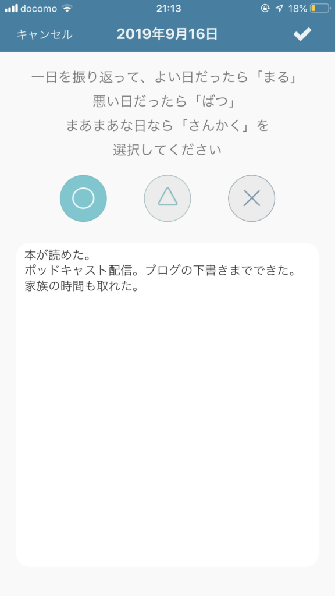
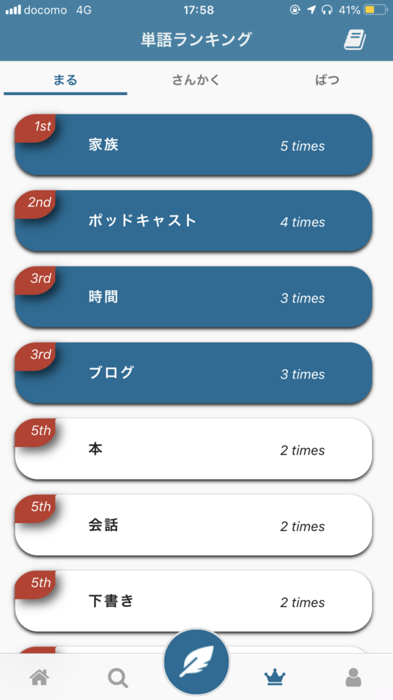
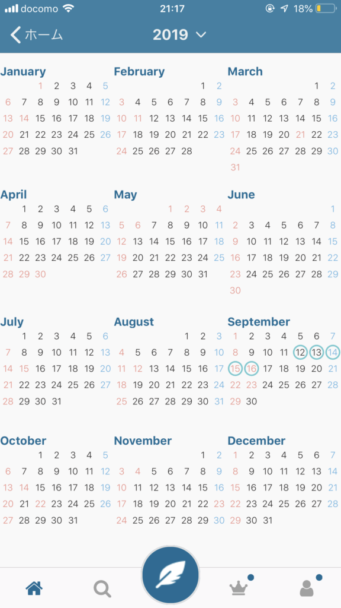

最近見つけた日記アプリ「ペンギン日記」をご紹介したいと思います。

可愛らしいペンギンのアイコンの日記なんですけど、なかなか面白そうな日記です。

このペンギン日記の特徴としては、「自分の価値観の確認と発見」ができます。

まず、このペンギン日記では一日の評価とその理由を書きます。評価は○△×の三段階です。

○がいい日、△が普通、×がダメな日みたいなイメージですね。

羽根ペンのアイコンで日記入力開始。ホーム画面では今日とった写真が表示されます。

日記入力画面です。

一日の評価をして、その理由を書いてもいいですし、一日の出来事を書いてみて、評価をつけてもいいと思います。

▼記入例

それぞれの評価のときに、日記中に出てきた単語の回数が、ランキングで分かります。

「○の時はこういう単語がいっぱい出てきてますよー」とか「△の時はこういう単語が多いですよ」っていうのが、ランキング形式で見られる仕組みになってるんですね。

このランキングがとてもいいです。

今のところ始めて一週間ぐらいしか経ってないんですけど、例えば私の場合、1位が「家族」2位が「ポッドキャスト」3位が「時間」なので、家族との時間やポッドキャストなどのアウトプットの時間を、大切に思っていることが分かります。

そして、ずっとやっていけばたぶん20～30位あたりに、自分でも思ってもみなかった単語がランキングされるんじゃないかなと思っています。

この自分でも思ってもみなかった価値観の発見、これができそうなアプリなのが、とても楽しみです。

あとはカレンダー形式で自分の評価を見ることができます。

直感的に○△×どれが多いかわかりますし、○△×のリズムとかが分かると、ランキングと組み合わせて、例えば○を増やすにはどうすればいいかというのも見えてきそうです。

個人的には評価が5段階ぐらいあればよかったなーというのはあります。

あと時々全画面広告が入るのがやや残念ですが、無料なのでそこは仕方ありませんね。

こういった日記アプリはなかなかないので、役立ちそうです。

この日記形式なら3分もかからずに書けますからね。毎日の日記に加えていきたいと思います。

無料アプリなので、気になる方はぜひダウンロードしてみてください。

Log is for Happy!!

**[ペンギン日記](https://apps.apple.com/jp/app/%E3%83%9A%E3%83%B3%E3%82%AE%E3%83%B3%E6%97%A5%E8%A8%98/id1435000956?uo=4&at=11l5XR)**  
価格: 0円(2019/09/16 21:21)  

[

* * *

▼ペンギン日記について話したポッドキャスト

https://anchor.fm/mailman/episodes/22-e5dng9

](https://apps.apple.com/jp/app/%E3%83%9A%E3%83%B3%E3%82%AE%E3%83%B3%E6%97%A5%E8%A8%98/id1435000956?uo=4&at=1010lxsX)
