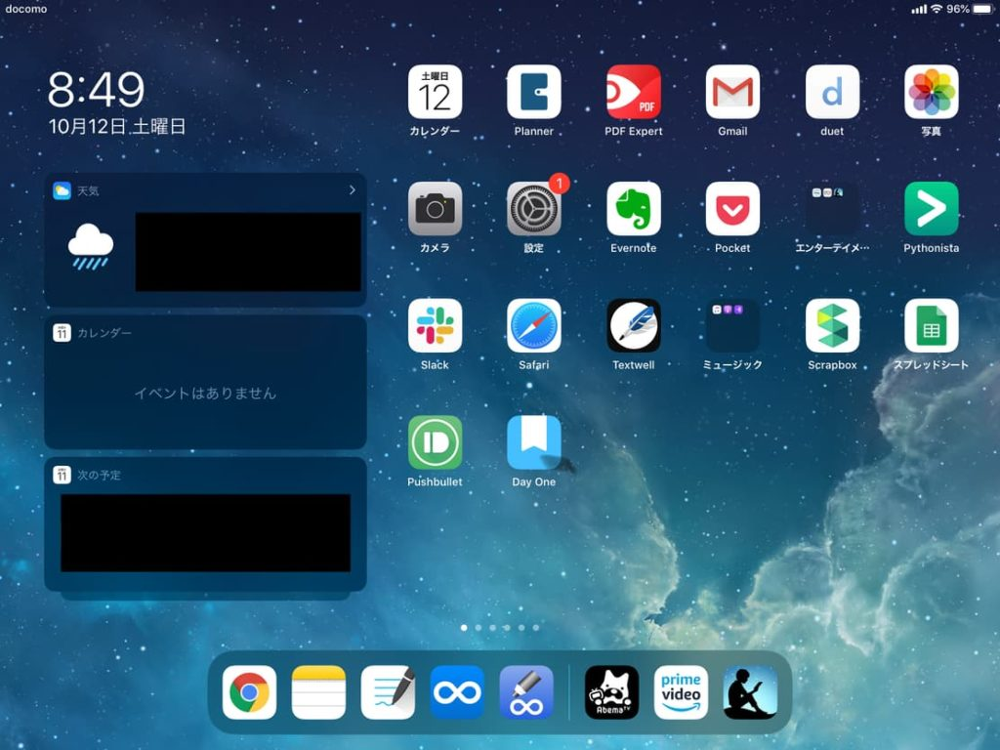
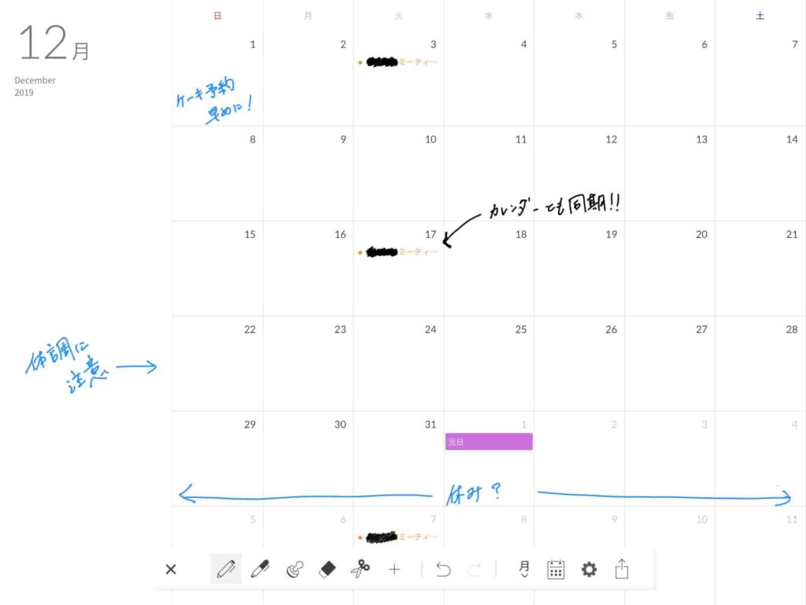
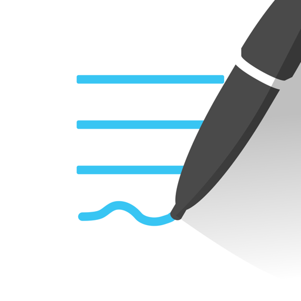
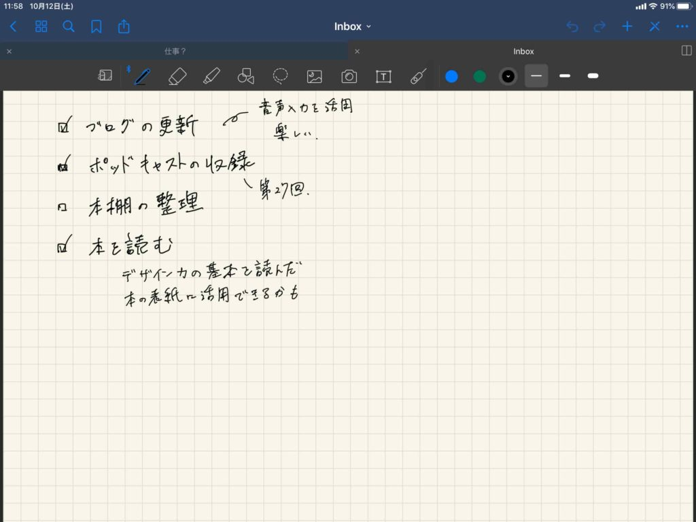
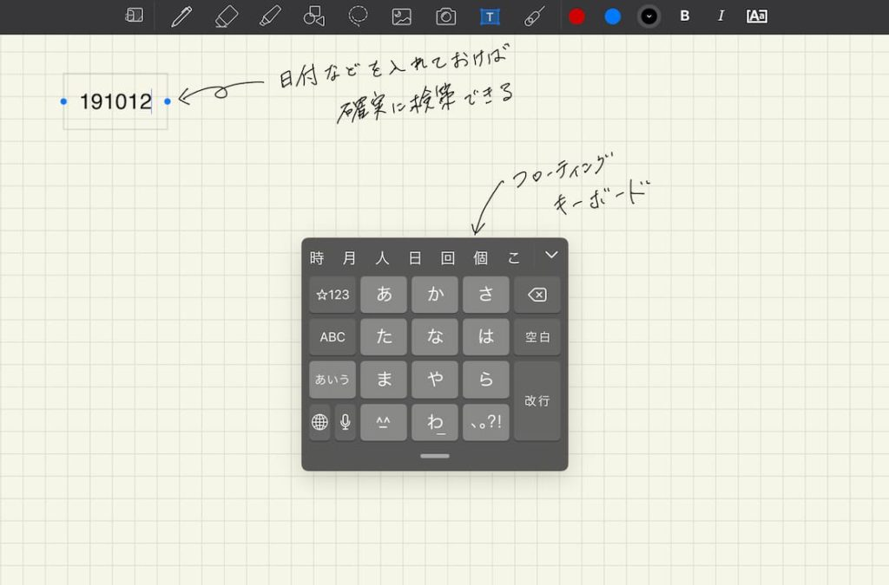
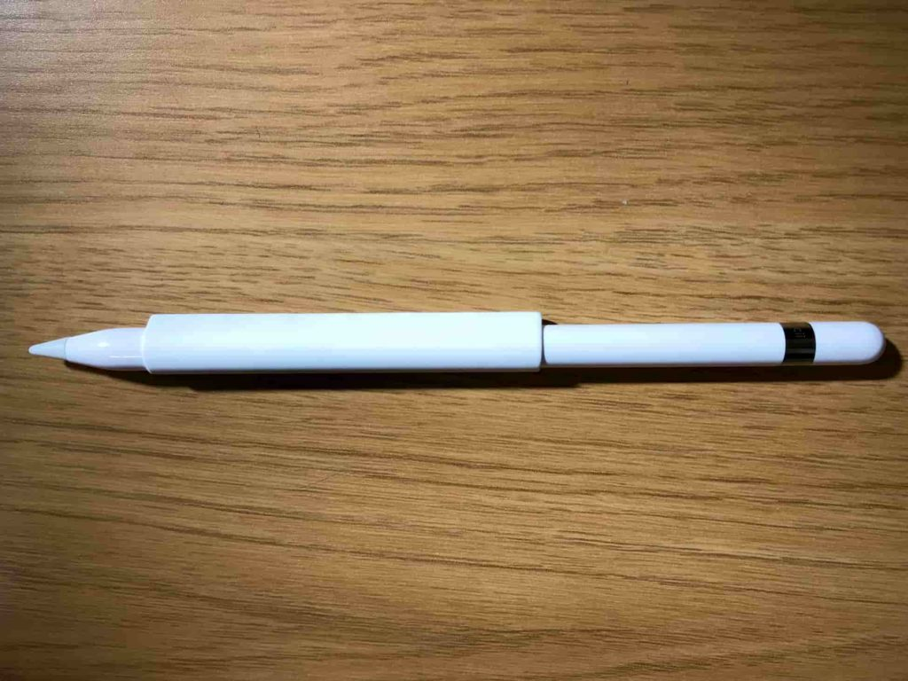
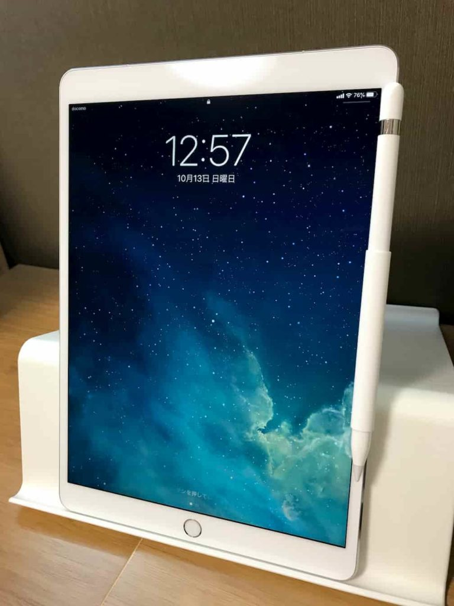
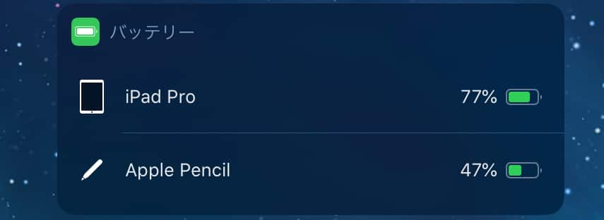

## 来年の手帳に悩む

来年の手帳をどうしようかなと悩む時期がやってきました。わたしも、最近どうしようかなぁと考えていました。

そんなとき、あまり活用されていなかったiPad ProをiPadOSにアップデートしたんですね。

そしたらですね、そのホーム画面がかっこよかったんですよ。

ヴィジェットが常に見えるようになって、カレンダーの次の予定とか天気を見ることができます。

「これ便利そうだな、手帳にしたら、もっと便利なんじゃ？せっかくApple Pencil持ってるんだし、手帳にしよう！」

ということで、してみました。今のところすごい快適です。

## 手帳の使い道

手帳の使い道は主に二つです

1. 月間カレンダーでスケジュール管理
2. ノートに雑多なメモ

### カレンダーを考える

まずはカレンダーをどうするか考えました。

Appleの純正のカレンダーとかでもできると思ったんですが、アナログの手帳の便利さが足りません。

アナログの手帳であれば、例えば

- ここら辺に予定が入りそう
- 簡単なタスクを書いて予定をイメージ
- この時期は疲れやすい

といった書き込みが柔軟に、手軽にできます。

もちろんAppleのカレンダーやGoogleカレンダー でも似たようなことはできますが、柔軟性が足りません。

そんな時に見つけたのが「Planner」というアプリです。

Appleのカレンダーと同期して、予定を表示してくれる上にApple Pencilで書き込みができます。

デジタルとアナログの夢の融合ですね。

これで、月間カレンダー問題はほぼ解決しました。

**[Planner for iPad](https://apps.apple.com/jp/app/planner-for-ipad/id1246635949?uo=4&at=11l5XR)**  
価格: 0円(2019/10/13 13:13)  

### ノートを考える

さて、次はノートです。

ノートはほとんど悩みませんでした。

現在GoodNotes5を使っていて、満足しているからです。

むしろ、書く内容によってノートを切り替えたりもできますし、アナログの手帳よりも便利になったともいえるでしょう。

**[GoodNotes 5](https://apps.apple.com/jp/app/goodnotes-5/id1444383602?uo=4&at=11l5XR)**  
価格: 980円(2019/10/13 13:15)  

## その他

### フローティングキーボード

iPadの不便なところとして、文字入力がやりにくいところがありました。

パソコンのキーボードを画面に出すと半分埋まってしまいます。しかも、物理キーボードと比べると打ちにくいです。

でもフローティングキーボードになって、iPhoneと同じように入力できようになりました。

たとえばノートに手書きではなく、デジタルで日付を書いておけば検索も確実です。

このフローティングキーボードが純正で使えるようになったのは、手帳化に地味に、ものすごい大きかったと思います。

### ホーム画面

最初に触れたようにヴィジェットが最初の画面に固定できるようになったので、今日の予定や次の予定を常にリマインドすることができます。

他にも色々なヴィジェットがあるので、ここも工夫のしがいがありそうです。

### Apple Pencil用グリップ

第二世代からiPad ProにくっつくようになったApple Pencilですが、第一世代にはくっつきません。

ペンと一緒に持ち歩けない手帳など手帳ではないのです(極論)。

そこで、マグネットがついている、このクリップを使っています。

マグネットがついており、突起部もあるので、ころころ転がっていくこともありません。

iPadの音量などのボタンがある方にくっつきます。

手帳化するならオススメのツールです。

iPad Pro以外のタブレットにもマグネットはくっつくので、このグリップも多分くっつくと思います(未検証)。

リンク

最後にiPadの手帳化のメリットとデメリットをご紹介します。

## メリット

### メリット１：手書きとデジタルの融合

やはりiPadを手帳化することのメリットは手書きとデジタルの融合でしょう。

手書きには手書きのメリットがあります。そして、デジタルにはデジタルのメリットがあります。

そして、Apple PencilとiPadを使えば、うまく両方を組み合わせることができます。

たとえば、今回紹介したPlannerは予定をデバイス間で同期できるというデジタル的なメリットに加えて、手書きでの記入も行うことができます。

（手書きした文字もデバイス間で同期できるとよかったのですが）

ノートの中の手書き文字の検索も可能です。GoodNotes5などのノートアプリは手書き文字の検索ができます。

また手書き文字を後から縮小したり、移動させたりすることもできます。

これも、手書きとデジタルのいいところを融合させているといえるでしょう。

こうした両方のいいところを融合させられるのが、第一のメリットといえます。

### メリット２： 共有のしやすさ

次に共有のしやすさです。

たとえばカレンダーの予定は、iPadだけでなくiPhoneでもチェックしたり、追記したりすることが可能です。

電車の時間なども、乗換案内などのアプリからすぐにカレンダーに予定としていれることができます。

またノートはある程度の区切りで、例えば会議ごとにPDFなどにして、パソコンに保存しておくことも可能です。

簡単な議事録とすることもできるでしょう。

アナログの手帳なら一度スキャンするなどの手間があります。

### メリット３： ノートのページは無限大

私の場合、手帳の残りページ数がだんだん少なくなってくると、書くペースを無意識に抑えてしまいます。

どこかで、今年いっぱいは、このページ数でもたせたいという意識が働いているのだと思います。

本来ならページ数よりも逃したアイディアなどの方が圧倒的にもったいないのです。

しかし、iPadを手帳にすれば、ノートのページ数は実質無制限です。ページ数など気にせず書くことができます。

また、去年やおととしの手帳だって、いつでも参照できます。

これは私にとって大きなメリットです。

## デメリット

### デメリット１： 重い

まず手帳と比べて重いです。

カバンに入れて持ち歩く分にはそこまで重さは感じませんが、片手で持ってメモを取るなどの作業には不向きです。

もし、片手で持って使うことが多い場合はiPad miniを使うと、重量感、作業感が手帳と近くなるはずです。

リンク

### デメリット２： 電池

Apple Pencil、iPad Proどちらかの充電が切れれば、そこでジ・エンドです。

充電しなおせばいいのですが、電池切れがないアナログの手帳と比べるとその点は見劣りします。

特にApple Pencilは充電残量がわかりにくいので注意が必要です。

ヴィジェットに充電残量を表示しておくと、充電切れを回避しやすくなります。

### デメリット３： 耐久性

紙の手帳は汚れても味が出てきたなぁと思いますが、iPadが汚れたときに味が出てきたなぁとはたぶん思えません。

そういう意味での耐久性は、紙よりは劣るでしょう。

また、紙の手帳は物置にでも入れておけば20年後でも読める状態で残っていると思いますが、iPad Proのデータが20年後もしっかり残っているかは不安です。

こうしたデータの保存については、記録としても残しておきたい方は考えておく必要があると考えています。

## 終わりに

来年の手帳について考えていたら、iPad Proの活用という思わぬところに着地しました。

新しいやり方に、わくわくしています。

次は来年の日記帳ですね。これも考えたいと思います。日記の場合は、耐久性の意味も考えて、紙でも残しておきたいのです。

それでは、またお会いしましょう。

Log is for Happy!!

* * *

▼こんな本も書いています。

リンク
