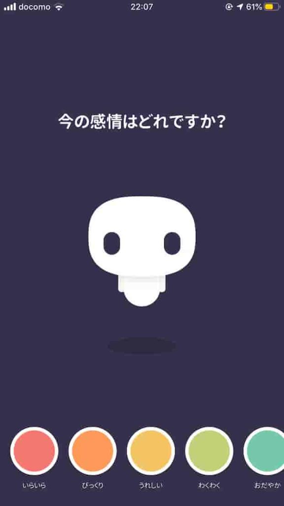
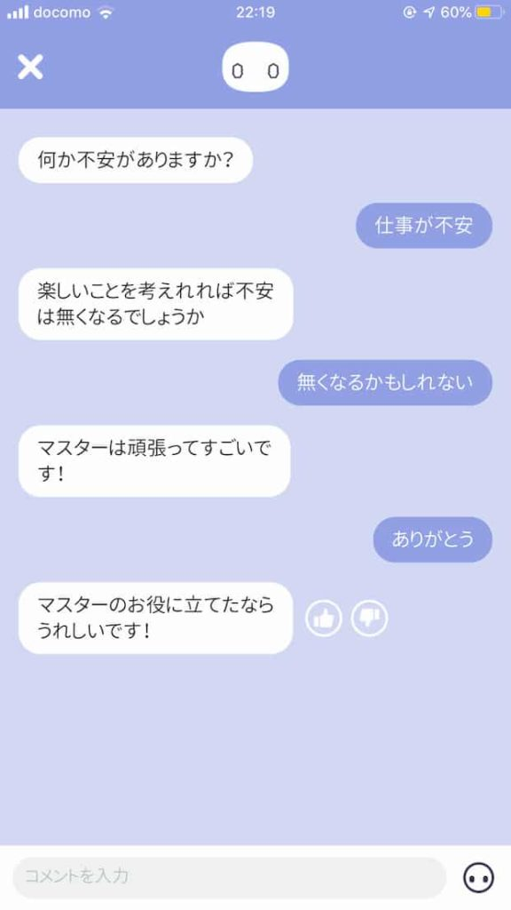
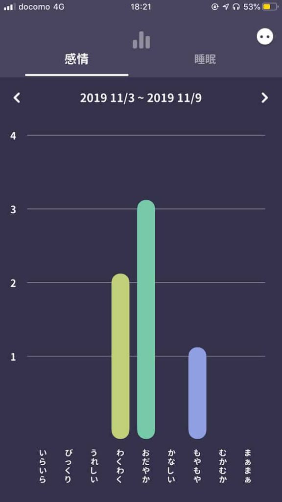

これまで、何個か日記ツールを紹介する記事を書いてきたんですが、もう少し突き詰めていきたいという思いが出てきました。

しかし、ただ漫然とやっていてもできそうにありません。そこで、「日記ツール大全」という企画で、ちょっとやっていこうかなと考えたます。

いろんな日記の書き方について突き詰めたいという想いは「日記大全」という企画にすることで、ある程度実現することができました。

[https://www.ashi-tano.jp/?tag=%e6%97%a5%e8%a8%98%e5%a4%a7%e5%85%a8](https://www.ashi-tano.jp/?tag=%e6%97%a5%e8%a8%98%e5%a4%a7%e5%85%a8)

日記ツールについても、「日記ツール大全」という企画にすることで、突き詰めていけるかもしれないという考えです。

連載としての日記ツール大全、第一回はアプリ「Emol（エモル）」をご紹介します。

## Emolとは

Emolは感情をメインに記録するアプリです。チャット形式で、自分の行動や想いなどを記録します。

まずは具体的な使い方を説明します。

アプリをダウンロードした後、位置情報の取得を許可するかどうかを選びます。

記録した場所を残しておきたい場合は、使用中は許可などを選んでおきましょう。

記録の手順としては、最初に今どんな感情なのかを画面下の一覧から選びます。

<figure>

<figcaption>

真ん中のキャラがAIのロクです

</figcaption>

</figure>

感情は、

- いらいら
- びっくり
- うれしい
- わくわく
- おだやか
- かなしい
- もやもや
- むかむか
- まぁまぁ

の９種類です。

感情を選択した後は、ロクとチャットします。

チャットをすることで、感情の原因を見つけ出したり、気分がすっきりさせることができます。

記録した時間と場所も一緒に残すことができるので、ネガティブな気持ちがどこで多いか、ポジティブな気持ちが起きやすいのはどこか、どんな時間に多いのかが分かってきます。

自分がポジティブな気持ちになるのはいつ、どんな環境かが分かってくれば、自分をどんな環境に置くのが好ましいのかが、自然と分かってくるはずです。

また、一週間のうちに、どんな感情が多かったかといった分析もできます。

## Emolのメリット

チャット形式のメリットのひとつは、質問などを投げかけてもらえることです。

書くことが思いつかなくても、質問を投げかけられることで、書くことが見つかったり、自分だけでは気づかなかったようなところまで、感情について深堀するしたりすることもできます。

また、AIなのでちょっとした愚痴もきちんと聞いてくれます。人には言いにくくても、AIなら気軽に言えることもあるはずです。

たとえばアメリカではチャットボットでうつ症状を改善させるツールなども出てきています。

[https://bita.jp/dml/woebot](https://bita.jp/dml/woebot)

若干、返事がまだまだ的外れだったりするときもありますが、AIなので学習するごとに改善されていくと思います。

欲を言えば、AIの返答を切り替えられたりできると楽しそうですね。

たとえば、「感情の理由をひたすらに深堀するモード」とか、「ひたすらにほめてくれるモード」などがあると、使い方の幅が広がりそうです。

ちょっとおもしろそうじゃないですか？

## 終わりに

というわけで「日記ツール大全」第一回は感情を記録するアプリ「Emol」でした。

**[Emol - AIと会話して心に癒しを](https://apps.apple.com/jp/app/emol-ai%E3%81%A8%E4%BC%9A%E8%A9%B1%E3%81%97%E3%81%A6%E5%BF%83%E3%81%AB%E7%99%92%E3%81%97%E3%82%92/id1342105183?uo=4&at=11l5XR)**  
価格: 0円(2019/11/09 17:34)  

twitterや[ポッドキャスト](https://anchor.fm/mailman)でも日記ツールや日記術について発信していますので、よかったらチェックしてみてくださいね！

<blockquote class="twitter-tweet">
感情を記録するツールEMOL。 まず今の自分の感情を記録して、そのあとAIのロクとチャットする。チャットすることで感情が起きた理由を話したり、深掘りしたりすることが可能。 理由が分からなくても、愚痴とかをいうだけでもすっきりするかも。<a href="https://twitter.com/hashtag/%E6%97%A5%E8%A8%98%E3%83%84%E3%83%BC%E3%83%AB%E5%A4%A7%E5%85%A8?src=hash&amp;ref_src=twsrc%5Etfw">#日記ツール大全</a> <a href="https://twitter.com/hashtag/%E6%97%A5%E8%A8%98%E8%A1%93?src=hash&amp;ref_src=twsrc%5Etfw">#日記術</a> <a href="https://twitter.com/hashtag/%E6%97%A5%E8%A8%98?src=hash&amp;ref_src=twsrc%5Etfw">#日記</a> <a href="https://t.co/CGsR570u3t">pic.twitter.com/CGsR570u3t</a>
— ゆうびんや@日記大全連載中 (@do_mailman) <a href="https://twitter.com/do_mailman/status/1192719907189874688?ref_src=twsrc%5Etfw">November 8, 2019</a></blockquote>

Log is for Happiness!!

* * *

▼こんな本も書いています。Kindle Unlimited対象です。
