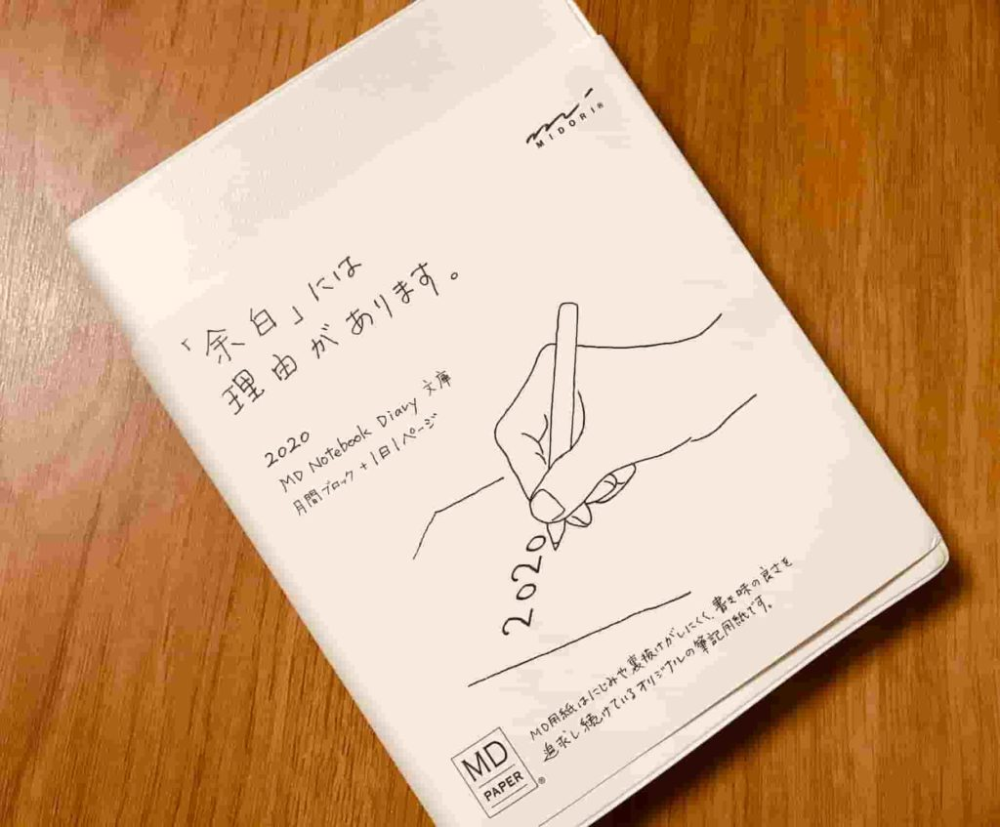
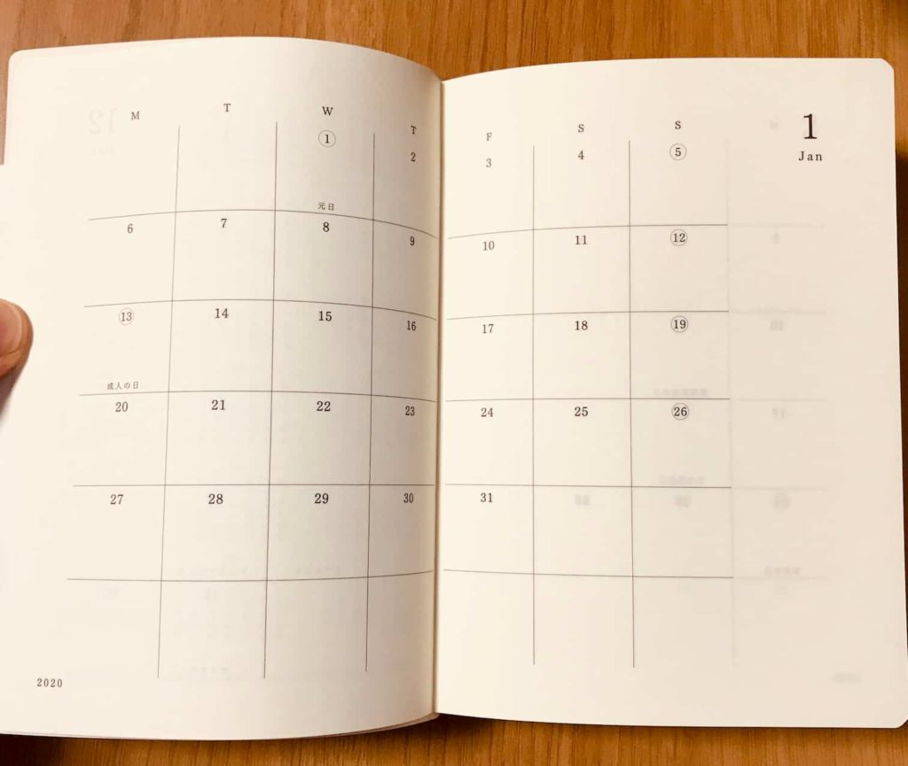
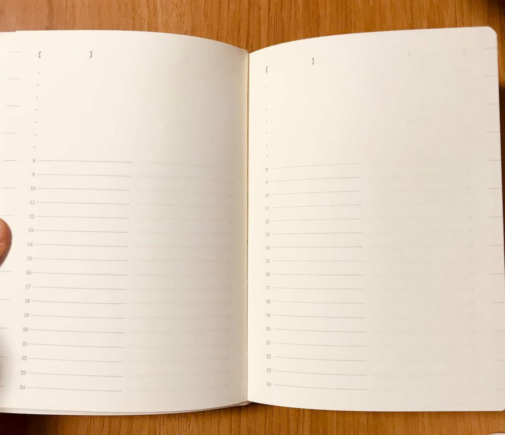

投稿日: {{ page.date | date: '%Y-%m-%d' }}

来年の日記はお決まりでしょうか？

私はこれ、ミドリの「MD Notebook Diary」に決めました。大きさは文庫版です。

ページの紹介と、個人的お気に入りポイントをご紹介します。

## 月間カレンダー

最初にあるのが月間カレンダーページです。

手帳としても使えるということだと思いますが、日記として使うのであれば、その月をさっと見返すためにも使えますね。

（Diaryって書いてあるのに、使い道は手帳な製品って結構多いですよね）

旅行日程を書いておいたり、どの時期仕事が忙しかったとか、風邪をひきやすいのはどこかとか、書いておくと良さそうです。

## デイリーページ

1日1ページのデイリーページです。

日付は入っていないので、自分で好きな日から始まることができます。上1/3が箇条書きスペースです。

例えば今日できたことを3つ書くとか、感謝日記をつけてみるとか、いろいろな使い方ができます。

箇条書きで書ける日記って案外色々あるので、よかったら、こちらの連載から気になるものをチェックしてみてください。

[https://www.ashi-tano.jp/?tag=%e6%97%a5%e8%a8%98%e5%a4%a7%e5%85%a8](https://www.ashi-tano.jp/?tag=%e6%97%a5%e8%a8%98%e5%a4%a7%e5%85%a8)

ページの真ん中から下部、左半分が時間を記録できるところ、右半分がフリースペースです。時間と一緒に簡単なメモをするだけでも、日記にできます。

- 昼ごはんのメニュー
- 観たテレビ番組
- 子どもの迷言

いろんなものが書けますね。

もっと詳しく書きたければ、右のフリースペースに書き足すこともできます。

フリースペースは、こうした補足を書くもよし、絵を描くもよし、気に入った本の文章を書くもよし、いろいろ書けますね。

## 個人的お気に入り

個人的には、時間と一緒に記録できるスペースがあるのがいいですね。

今日何があったかを、時系列で記録しようとすることで、1日を朝からざっと思い返すことができます。

夜に日記を書くと、夕方や夜にあったことに目がむきがちですが、1日は朝からあるのです。

そんな事実を、思い出させてくれるフォーマットが好みですね。

あとたっぷりある余白や、手触りのいい紙質、しっかりとした表紙も好感が持てます。

他にも月ごとのインデックスがつけられる、インデックスシールもついていますので、読み返すときの手助けとなりそうです。

来年も楽しく日記が書けそう（うれしい）。

というわけで、今回はミドリの「MD Notebook Diary」の紹介でした。

文庫版だけでなく、A5版などもあるので、大きいのが好みの人はそちらもいいかもしれません。

リンク

こうした情報は、だいたいまずポッドキャストでお届けしてますので、よろしければポッドキャストもお聞きください！

<iframe src="https://anchor.fm/mailman/embed/episodes/35-MD-e9br2a" height="102px" width="400px"></iframe>

Log is for Happy!!

* * *
