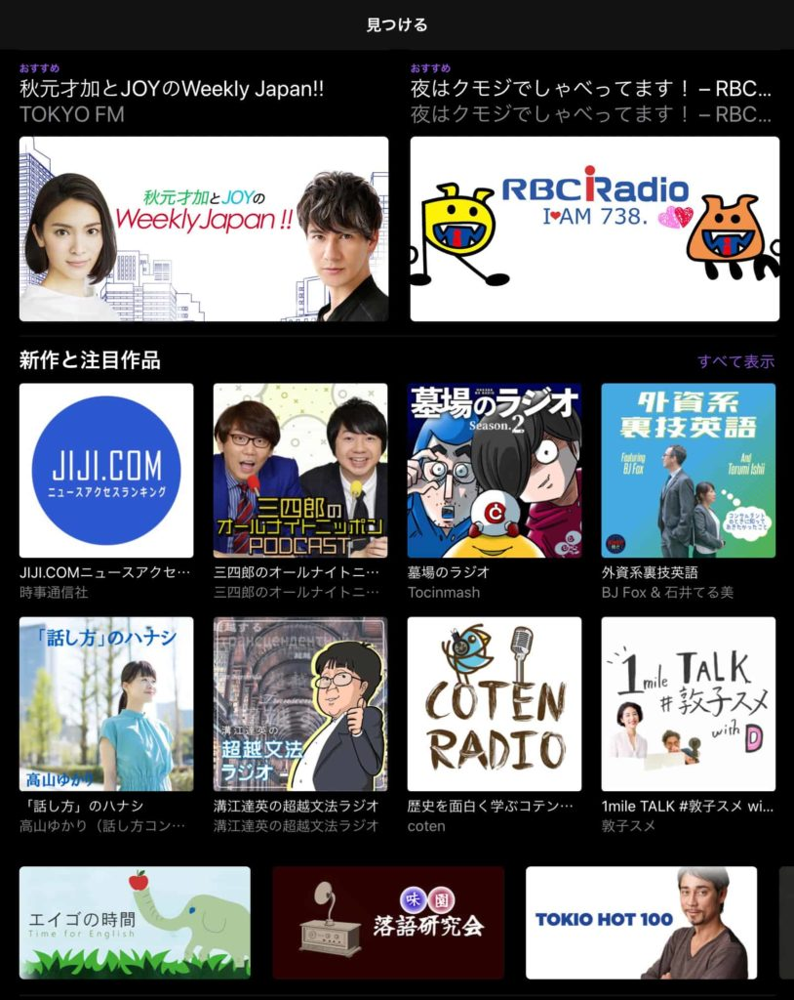
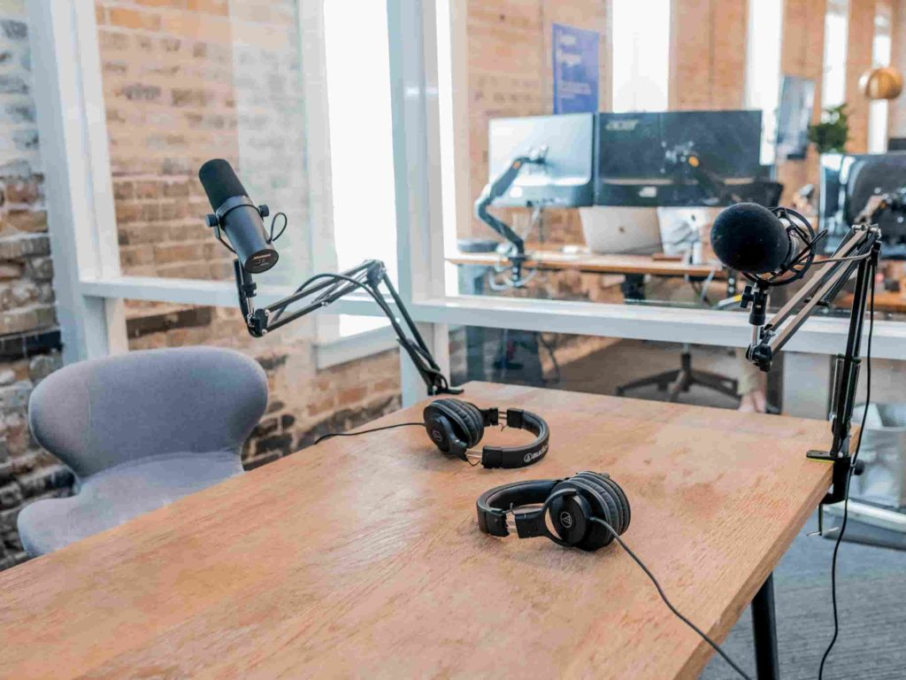
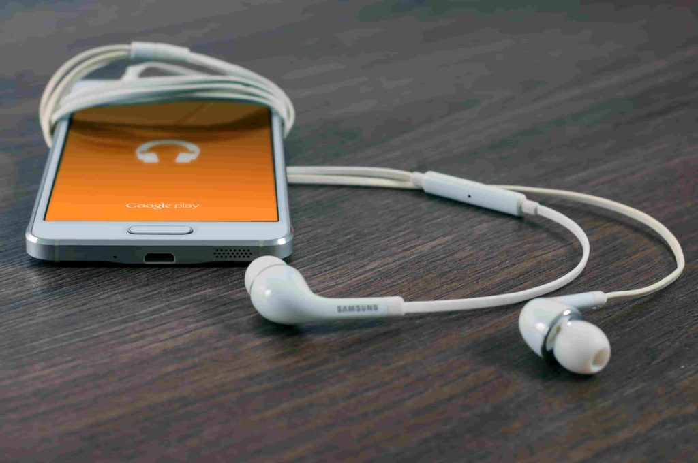

この記事は『ゼロから始めるポッドキャスト～言いたいことをいう生活』の前書きです。

本の雰囲気が少しでも伝われば、幸いです。

### はじめに

　本書を手に取っていただき、ありがとうございます。

　この本を手に取ったということは、ポッドキャストで発信することに少しでも興味をお持ちのことと思います。

　この本は「ゼロから始めるポッドキャスト」の名前の通り、ゼロからポッドキャストを始めるための本です。

　本書を読むことで、ポッドキャストを始めるイメージや具体的な手順をつかむことをひとつのテーマとしています。

「ポッドキャスト」という言葉は、もともとはアップルの「iPod（アイポッド）」シリーズと、放送を意味する「broadcast（ブロードキャスト）」が組み合わせられた造語で、「iPodシリーズなどの携帯プレイヤーに、音声データファイルを保存して聴く事が可能な配信の仕組み」を意味します。

　簡単に言えば、ネットを介していつでも聴けるラジオを配信するようなものです。

　たとえばiTunesなどで次のページのようなポッドキャストの配信画面を見たことがある方もいらっしゃるのではないでしょうか。

　たくさんの番組が配信されていることが分かります。そんなポッドキャスト、言葉だけ聞くと尻込みしてしまいそうです。

　ポッドキャストの配信に、特別な機材を使っているイメージがある方もいらっしゃるのではないでしょうか。しかし、最近ではかなり簡単に配信できるようになっているのです。

　その気になれば、お持ちのスマホやタブレット、そして「Anchor」というアプリを使い、今日中にポッドキャストを始めることができます。

<figure>

<figcaption>

専用機材が必要？

</figcaption>

</figure>

<figure>

<figcaption>

スマホとイヤホンマイクでＯＫ！

</figcaption>

</figure>

　この本では、アプリ「Anchor」を使って、ポッドキャストを始める方法をご紹介しています。

　また、この本のもう一つのテーマは「楽しさ」です。

　ポッドキャストで好きなことを話すのはものすごい楽しいことを、みなさんに体験してほしいのです。

　最近は好みが細分化してきているため、自分が好きなことを、周りの人も好きなことが少なくなってきました。

　自分の好きなものや、推したいものに関して話せる人が身近にいることは、幸運とも言えます。もちろんtwitterやFacebookなどのSNSや、ブログを使って情報発信をすることは可能です。

　しかし、twitterで自分の話したいことをすべて表すことができるでしょうか？

　文字数だけ考えても、とても無理です。

　では、ブログならどうでしょう？

　ブログなら文字数はいくらでも増やすことができます。しかし、文字数が多くなればなるほど、人に伝えるためには文章力が必要になってきます。

　わたしもブログを書きますし、こんな本を書くぐらいですから、文章で発信することにある種の喜びを感じる人種です。しかし、世の中そんな人種ばかりではないことも承知しています。

　文章で発信することは、人によっては高いハードルとなります。しかし文章を書くのは苦手でも、話すのは得意な方だっているはずです。また人前で話すのが苦手でも、友達の前で自分のペースで話すことは好きな方は多いでしょう。

　わたしも話すのは不得意で、無口な方です。しかし、ポッドキャストは自分のペースで話せますし、失敗してもやり直すことができます。

　だから、話すのが苦手なわたしでも、楽しく続けることができました。

　ポッドキャストは慣れてしまえば、ブログなどよりも楽に楽しく続けられる趣味となるのです。

　また最近では、ポッドキャストのニュースを少し聞くようになってきました。その理由の一つが、GoogleやAmazonなどが発売しているスマートスピーカーです。

　このスマートスピーカーのコンテンツは「音」ですから、ラジオやポッドキャストなどの音声メディアにも自然と注目が集まります。

　それは、3章でご紹介するポッドキャスト配信サービスの「Anchor」が、音楽ストリーミングサービスの雄「Spotify」に買収されたことにも伺えます。

　ブログやYoutubeなどの波と比べれば小さいですが、ポッドキャストへの波は少しずつ来ているのです。

　最後に簡単に自己紹介させてください。著者のゆうびんやと申します。34歳一児の父です。昼間は会社に勤めつつ、趣味としてブログやポッドキャスト、このような本の執筆をしています。

　ポッドキャストを始めて、まだ一年足らずの初心者です。しかし、そんな初心者だからこそ、いまからポッドキャストを始めるあなたの少し先を照らす手助けができると思っています。

　楽しいポッドキャストライフを一緒に始めてみませんか？
