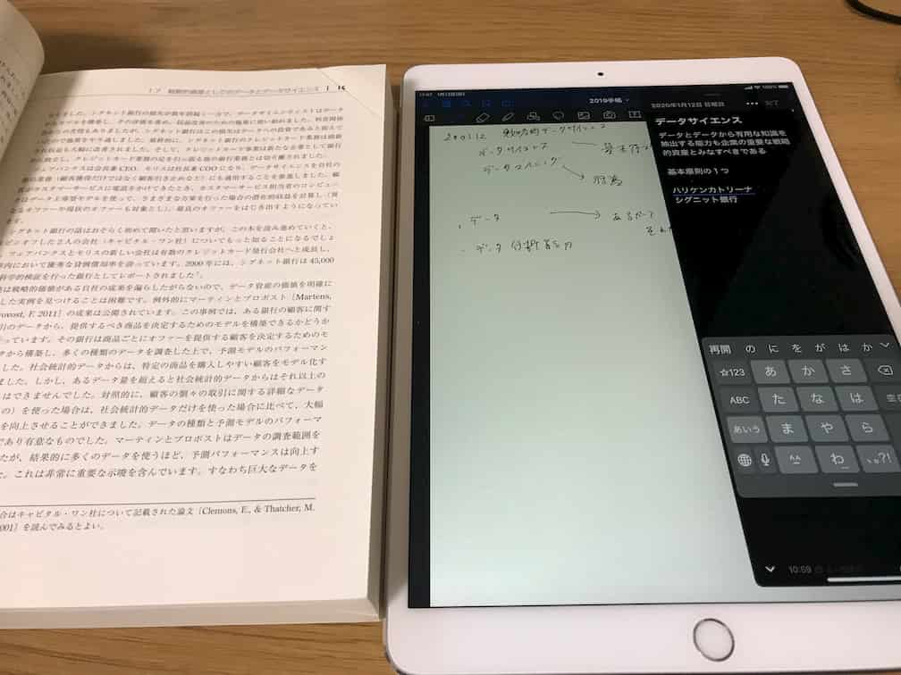

去年からiPad Proを手帳やノートとして活用するようになりました。

https://log-is-fun.com/ipad-tetyou/

この手帳化により、手書きのものはできるだけiPadに書くようになりました。

つまり、勉強や読書のときもiPadを使うわけです。

そして最近おすすめのiPadを使った勉強方法が、こちら。

**手で書くだけでなく口でもアウトプットする方法です。**

勉強をしながら、手を動かしてポイントをメモしたりするなら、やはり手書きがベストです。

しかし、目で見たものを手で書いているだけでは本当にポイントが理解しているか分からないことがあります。

たとえば、勉強しているときに「なるほど、分かった」と思った内容でも、いざ口に出して説明しようとするとうまくできないことが多々あります。

自分では理解したつもりでも、実はまだ理解が足りていないのです。

声に出すことで、理解不足に気づくことができます。

しかし、普通に勉強していたのでは、声に出してアウトプットすることはほとんどありません。

そこで音声入力を使って、勉強の内容をアウトプットしてしてみましょう。

今スマホでこの記事を見ているのであれば、文字入力の時にマイクボタンを押すだけですぐに始められます。

そしてiPadなら、手書き用のアプリと音声入力でポイントをまとめるアプリを同時に使うことができます。

それだけで目で見て、手で書き、声に出し、耳で聞く、自分の五感のほとんどを活用した勉強法の完成です。

<figure>

<figcaption>

実際に使っているとき

</figcaption>

</figure>

手書き用アプリにはGoodNotesやNotability、ポイントをまとめるものにはDayOneやEvernoteがおすすめです。

ぜひ試してみてください。

* * *

▼元ネタポッドキャスト

https://open.spotify.com/episode/6WvcuQX50jquYWDGTcpC2X?si=a214-jcgSxejOQ5haZ5OEQ
