個人的にSpotifyは最大規模のポッドキャストプラットフォームになるだろうと予想しています。

noteにも少し書きましたが、投資やマネタイズの面を見ても、Spotifyが強そうです。

[https://note.com/mailman/n/n5850f57692f0](https://note.com/mailman/n/n5850f57692f0)

そんなSpotifyは昨年「Spotify for Podcasters」という分析ツールを出しました。

プラットフォームになりそうなSpotifyが出した分析ツールですから、ぜひともやってみたいところです。

そこで、今回は遅ればせながら「Spotify for Podcasters」の登録方法をご紹介します。

この分析ツールが、分析できるのはSpotifyで聴かれた分だけですが、それでも自分のポッドキャストを分析するには良いツールです。

## Anchorで配信している場合

Anchorでポッドキャスト配信をされていない方はこの項目は飛ばしてください。

Anchorでポッドキャストを配信されている方は、 「Spotify for Podcasters」 へ登録する前にRSS feedに自分のメールアドレスを表示させる必要があります。

Anchorを使ってPodcastを配信されている場合は、アプリではなくAnchorのサイトからログインして、メニューの中の「Distribution」から下の画像の矢印の部分を紫にしてください。

[https://anchor.fm/dashboard](https://anchor.fm/dashboard)

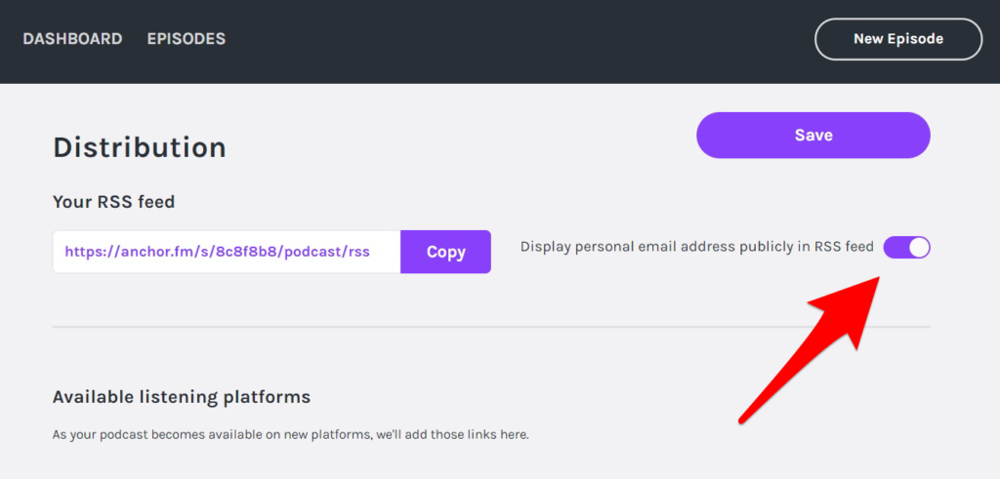

15分ほど待った後、「Spotify for Podcasters」へ登録しましょう。

そして、もしSpotifyに既に配信が完了されている場合は、登録のためにSpotifyにメールで問い合わせる必要があるかもしれません。

私の場合は問い合わせることになりました。

問い合わせの文面はこの記事の最後に載せてありますので、ひとまずはこの記事をざっと読んでから 「Spotify for Podcasters」 への登録を始めてみてください。

## ログイン

それでは 「Spotify for Podcasters」 へ自分のポッドキャストを登録しましょう。

まずはログインです。

[https://podcasters.spotify.com/](https://podcasters.spotify.com/)

「GET STARTED」をクリックします。

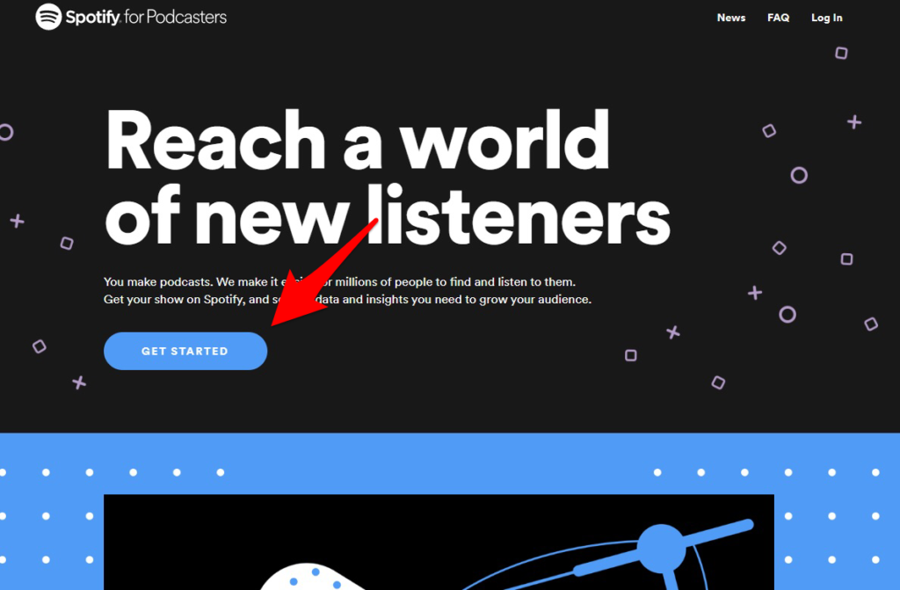

お持ちのSpotifyのアカウントでログインしましょう。Spotifyのアカウントを持っていない場合は登録が必要です。

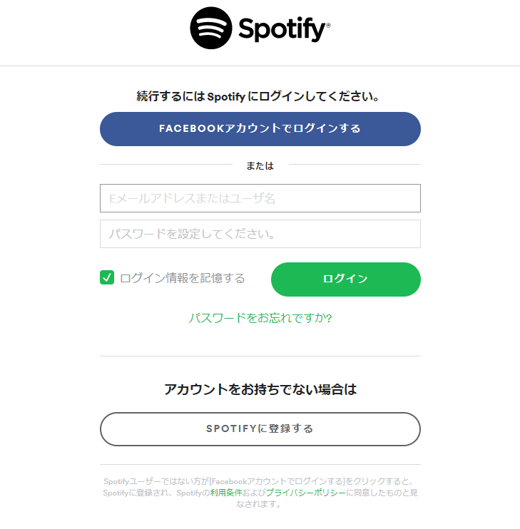

## RSS登録

次は自分のポッドキャストのRSSを登録します。

ログインすると以下の表示が出るので、「GET STARTED」をクリックします。

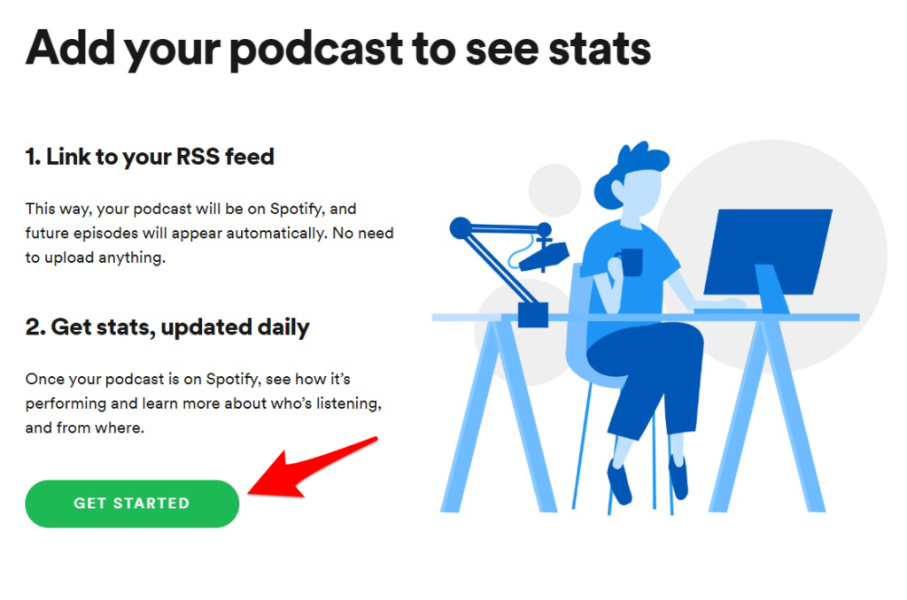

「Link to RSS feed」のところに、自分のRSSのURLを入れましょう。

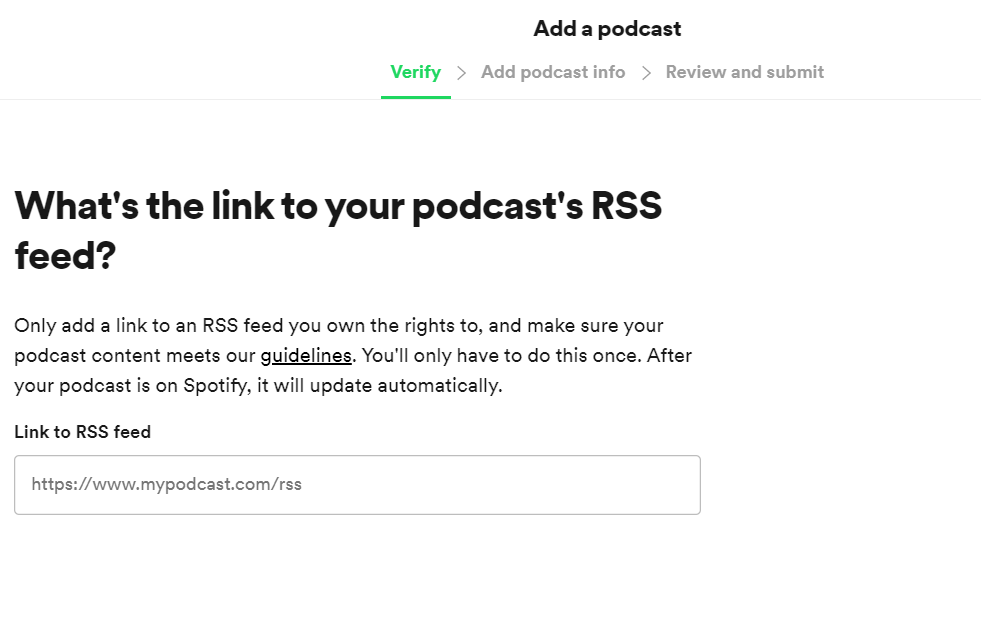

入れると、自分のポッドキャストが表示されます。

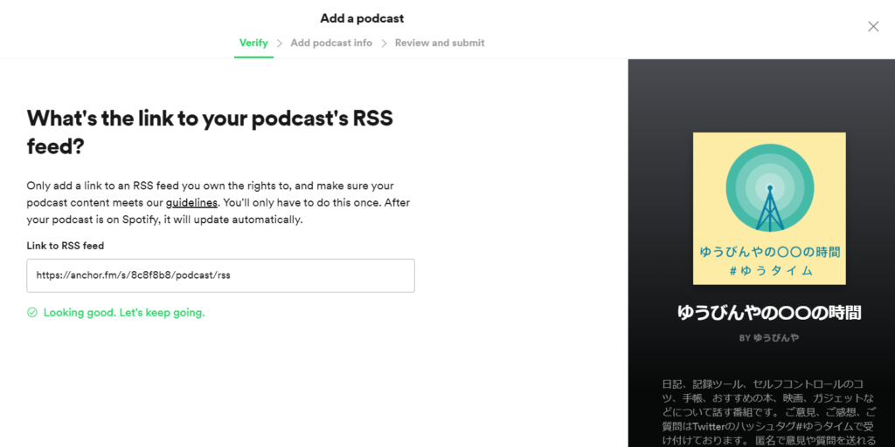

次はメール認証です。ここで「SEND CODE」を押すと、あなたのRSS feedに入っているメールアドレスに認証コードとして8桁の数字が送られます。

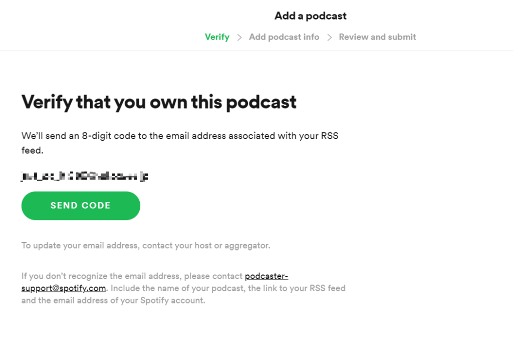

送られてきた8桁の数字を入力すれば、認証は終了です。

## カテゴリなどを登録

次はポッドキャストのカテゴリなどを登録します。

入力する情報は以下の5つです。

1. あなたの住んでいる国
2. 主要言語
3. ポッドキャストプロバイダー
4. メインカテゴリー
5. サブカテゴリ （3つまで選べます）

私が登録した時の画面が下の画像です。

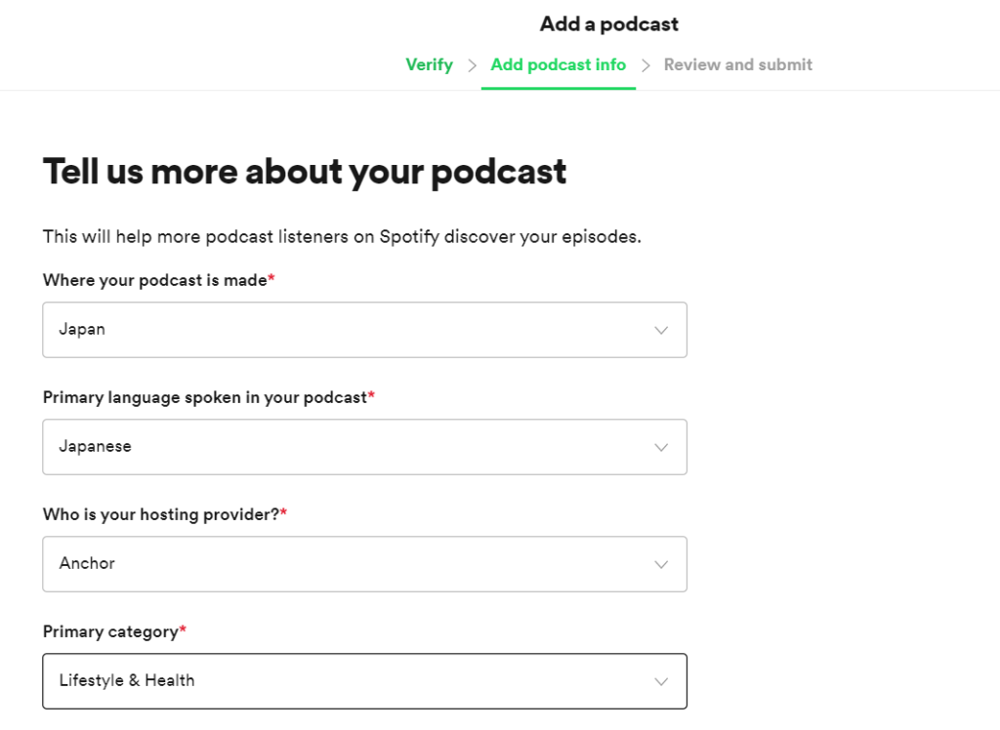

一応テキストでも私の記入例を載せておきます。

1. あなたの住んでいる国
    - Japan
2. 主要言語
    - Japanese
3. ポッドキャストプロバイダー
    - Anchor
4. メインカテゴリー
    - Lyfestyle & Health
5. サブカテゴリ（3つまで選べます）
    - Lyfestyle,Self-help,Hobbies

ちなみにメインカテゴリーだけでは、自分のポッドキャストをカテゴライズできない場合は、アディショナルカテゴリーを追加することも可能です。

全ての項目を選択し終わったら、確認画面へ行きます。

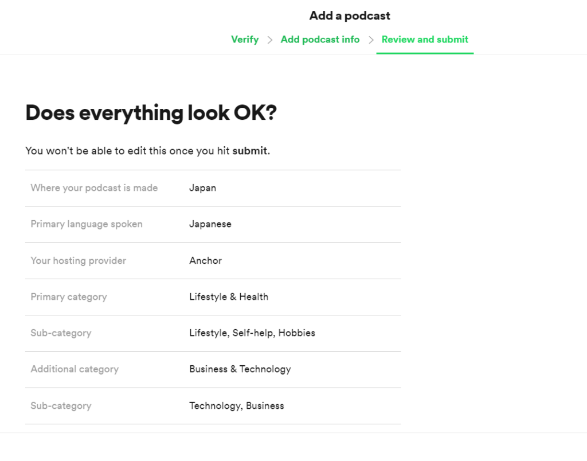

Submitをクリックした後はもう変更することはできないので、注意してください。

無事に登録された方は、これにて完了です！

お疲れさまでした！

そして、私と同じように以下の画面が出た方は、残念ながらSpotifyに直接問い合わせが必要です。

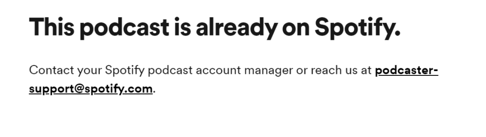

私の場合はAnchor経由でSpotifyに既に登録されていたので、この画面が出たと思われます。

ただ、Anchorの説明だと「RSS登録すればSpotify for Podcastersに登録できるよー」としか書いてなかったんですよねー

なんででしょう。

とりあえず、画面に出た問い合わせ用のメールアドレスに私のつたない英語で以下のようなメールを打つと、翌日には登録されていました。

<figure>

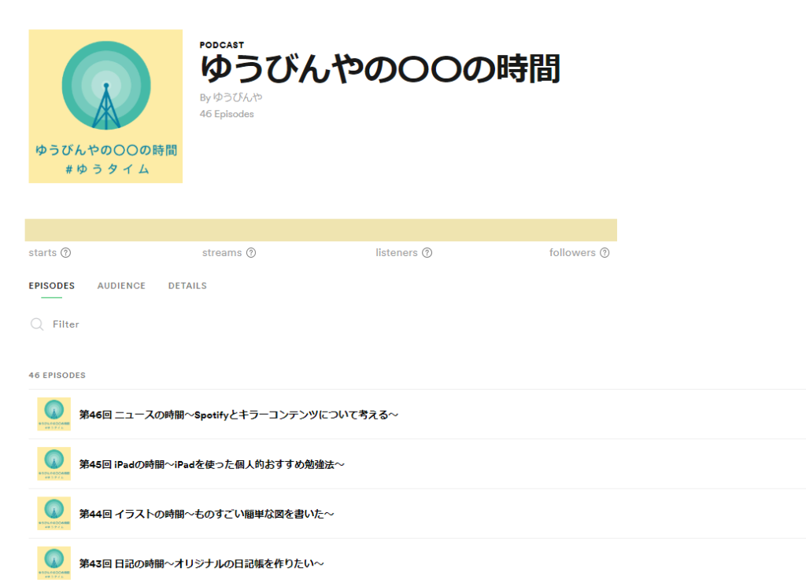

<figcaption>

登録された！

</figcaption>

</figure>

参考までに問い合わせたときの英文を載せておきます。コピペして使っていただいて構いません。

> Hi
> 
> I'm （名前）
> 
> I want to use Spotify for Podcasters but my request is rejected because "This podcast is already on Spotify"
> 
> I use Anchor to distribusion and already display Email address in my RSS Feed.
> 
> So I want to know how to register my podcast in Spotify for Podcasters.
> 
> Here is my information.
> 
> podcast name
> 
> 　ゆうびんやの○○の時間
> 
> RSS feed
> 
> 　https://anchor.fm/s/8c8f8b8/podcast/rss
> 
> Spotify account
> 
> 　（Spotifyに登録しているメールアドレス）
> 
> Sincerely
> 
> （名前）

さて、次回は「Spotify for Podcasters」でどんな分析ができるのかをご紹介したいと思います。

お楽しみに。

▼こんな本も書いています。

* * *

ポッドキャスト「ゆうびんやの○○の時間」でもこの記事のような情報を話しています（話していないときもあります）。

https://open.spotify.com/episode/1BCnYmF9YQJfwLprtvScj5

以下のURLからSpotifyなどのお好きなポッドキャスト用アプリでお聞きください。
