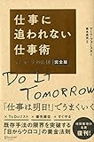

いらいらしたりしているときに日記にじぶんの思っていることを書き込むことでいらいらがすっと治まったりします。なぜそうなるのか？それは「ラべリング」の効果です。

<!--more-->

## ラべリングとは？

ラべリングとは自分の思っていることや感情に流されてしてしまいそうな行動を口に出したり書き出すことです。「マニャーナの法則」に以下のような文があります

> ここで 「ラべリング 」という手法を登場させます 。何らかの衝動を感じたら 、 「コーヒーが飲みたい 」 「電話がしたい 」と衝動の内容を口に出して 〝ラベルを貼る 〟ことではっきり認識してください 。ラベルを貼ることで 、衝動がはっきり意識されると 、その衝動が消しやすくなります。
> 
> 「マニャーナの法則」 No.2258

自分の思っていることを口に出したり、書き出すことで感情をコントロールしやすくできます。それはなぜなのでしょうか？

## 自分から切り離す

自分を客観的に判断することはひとはかなり苦手です。たとえばひとから「ちょっと最近飲みすぎて太ってきてしまったのでなにかいい方法はないかな？」と聞かれたら、たいていのひとは「飲まないようすればいい」と考えるのではないでしょうか。

でもじぶんが「最近飲みすぎて太ってきてしまったな。どうしようかな？」と考えた時にすっと「飲まないようにする」と考えられないんですよね。「なにかうまい方法はないか。運動とか？いやそれよりもサプリメントとか」「待てよ、おつまみを揚げ物じゃなくすれば」などなどと考えてしまいます。

しかし口に出したり、書き出すことで自分から切り離すことができるので客観的に判断しやすくなります。

## 日記で常にラべリングする

そしてこのラべリングが簡単にできるのが日記です。

- 夜なのにお菓子が食べたい
- 明日早いけど夜ふかししたい
- 衝動買いしてしまいたい

こうしたじぶんの感情をそのまま書けば、それがそのままラべリングになり、衝動をコントロールしやすくなります。そしてそれは記録になり、次に活用もできます。

## 終わりに

もちろんメモに書き出しても効果はあると思います。ただ日記に書き出せば次に活用できるのでおすすめです。

簡単にできるのでぜひ試してみてください。ゆうびんやでした。

* * *

時間、タスク、自己管理の名著の中の一冊。

[仕事に追われない仕事術 マニャーナの法則・完全版\[Kindle版\]](//af.moshimo.com/af/c/click?a_id=600112&p_id=170&pc_id=185&pl_id=4062&s_v=b5Rz2P0601xu&url=http%3A%2F%2Fwww.amazon.co.jp%2Fexec%2Fobidos%2FASIN%2FB01M8KY98X%2Fref%3Dnosim) posted with [ヨメレバ](http://yomereba.com)

マーク・フォースター ディスカヴァー・トゥエンティワン 2016-10-22

[Kindleで調べる](//af.moshimo.com/af/c/click?a_id=600112&p_id=170&pc_id=185&pl_id=4062&s_v=b5Rz2P0601xu&url=http%3A%2F%2Fwww.amazon.co.jp%2Fexec%2Fobidos%2FASIN%2FB01M8KY98X%2F)[Amazon\[書籍版\]で調べる](//af.moshimo.com/af/c/click?a_id=600112&p_id=170&pc_id=185&pl_id=4062&s_v=b5Rz2P0601xu&url=http%3A%2F%2Fwww.amazon.co.jp%2Fexec%2Fobidos%2FASIN%2F4799319809%2F)
