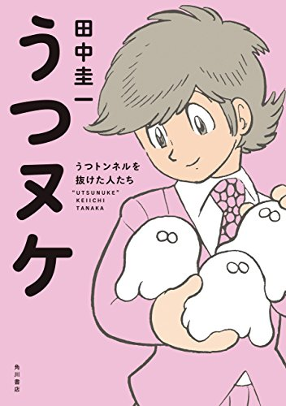
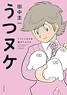

うつヌケというマンガを読みました。

概要をamazonの商品説明から引用します。

> 著者自身のうつ病脱出体験をベースにうつ病からの脱出に成功した人たちをレポート。うつ病について実体験から知識を学べ、かつ悩みを分かち合い勇気付けられる、画期的なドキュメンタリーコミック！

うつになりそうというわけではないのですが、[シゴタノ](http://cyblog.jp/modules/weblogs/26175)で紹介されていたので読んでみました。そしてこれはうつにどうしてなるのか、うつへどう対処すればいいのかが学べるだけでなく、日記などの記録の大事さも教えてくれるマンガでした。

お試し版が無料で読めるのでこちらからどうぞ

[https://note.mu/keiichisennsei/m/m1e241522cab9](https://note.mu/keiichisennsei/m/m1e241522cab9)

<!--more-->

## じぶんを客観的に把握して、うつの「突然リターン」へ対処する

> ぼくの「うつ」を重くしているのは「はげしい気温差」!?
> 
> うつヌケ p21

うつには回復しても、もういちど症状が突然復活することがあります。それをこのマンガのなかでは「突然リターン」といいます。

その突然リターンを予期できるようになったのは「気温が急変する日に突然リターンが起きている」事実からでした。

これはひとによっては「え、そんなことで突然リターンになるの？」と思うかもしれませんが、本人たちにしてみればとてもとても大事なことです。そしてうつになっていない人にも大事なことなんです！（力説）

たとえば夜に思い悩んでいたことが朝になると全然たいしたことじゃないと思えることはありませんか？

こういった「夜はたいしたことじゃなくても思い悩んだりしやすい」という事実に気づき、対処法に活かせるかどうかで大げさに言えば生きやすさが変わってくると思います。

ですから日記などの記録からこうした対処法に気づくことはとても大事です。「突然リターン」は死に至るリスクすらあるのですから。

## 記録による俯瞰で変化が分かる

> 毎日ほんの少しずつ治っていくものなので実感しにくいけど
> 
> ある日ふりむくと
> 
> ずいぶんとよくなってた
> 
> そんな日が来たんです
> 
> うつヌケ　58p

うつの回復は一気に進みません。少しずつ行きつ戻りつ回復していきます。その現状だけ見ていると、遅々として進まない回復にじれったくなるものです。

しかし記録を振り返ることで過去の長い期間を俯瞰してみることができます。そうすると着実に回復しているとわかります。

例えば1年前、2年前の日記を読んでみるとわたし自身いろいろ変わっています。じぶんが変わっていけることが実感できることは、じぶんのモチベーションを保つことにもつながります。

筋トレも筋力がついていることが実感できなかったり、外見が変わらなかったらモチベーションは続きません。

## 気分は絶えず変わるもの

> 私の心は自分が思っている以上に単純な作りになっているのだな...
> 
> 晴れも曇りも代わる代わる周期的にやってくるわけで
> 
> 不安な日も天気と同じくらいパタパタっと去っていくはず
> 
> 「その程度のものなんだ」
> 
> うつヌケ p41

気分はとても変わりやすいものです。少し前まで楽しいと思っていたのにふとしたきっかけで気分が落ち込んだりします。そして落ち込んでいたと思ったらいつの間にかそのことを忘れていることもあります。

気分というものは案外そんなものです。そして日記などの記録をとることでそのことが知識ではなく実感としてわかることがとても大事だと思います。

## 終わりに

そのほかにも日記を振り返ることでうつになりがちなひとの共通項「主観と客観の間のゆがみ」に気づけたりします。日記を書くことはうつを防止するのにも役立つのではないでしょうか。

ゆうびんやでした。

## この本から分かること

1. なぜうつになるのか？
2. うつになったらどうすればいいのか？
3. 日記などの記録の大切さ

* * *

[うつヌケ　うつトンネルを抜けた人たち　【電子書籍限定　フルカラーバージョン】<うつヌケ> (角川書店単行本)\[Kindle版\]](//af.moshimo.com/af/c/click?a_id=600112&p_id=170&pc_id=185&pl_id=4062&s_v=b5Rz2P0601xu&url=http%3A%2F%2Fwww.amazon.co.jp%2Fexec%2Fobidos%2FASIN%2FB01N9SHVRJ%2Fref%3Dnosim) posted with [ヨメレバ](http://yomereba.com)

田中 圭一 KADOKAWA / 角川書店 2017-01-19    

[Kindleで調べる](//af.moshimo.com/af/c/click?a_id=600112&p_id=170&pc_id=185&pl_id=4062&s_v=b5Rz2P0601xu&url=http%3A%2F%2Fwww.amazon.co.jp%2Fexec%2Fobidos%2FASIN%2FB01N9SHVRJ%2F)[Amazon\[書籍版\]で調べる](//af.moshimo.com/af/c/click?a_id=600112&p_id=170&pc_id=185&pl_id=4062&s_v=b5Rz2P0601xu&url=http%3A%2F%2Fwww.amazon.co.jp%2Fexec%2Fobidos%2FASIN%2F4041037085%2F)
